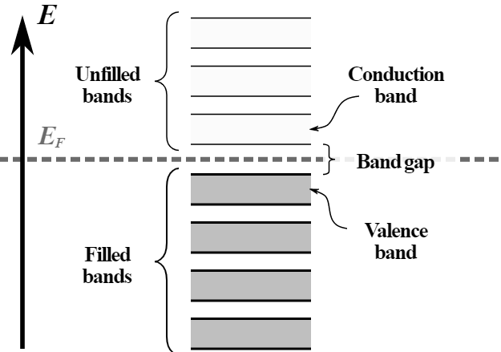
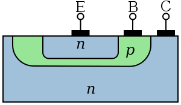

# CH1 - 電子元件及波形基本認識

電子學: 討論荷電質點在氣體、真空或半導體中遷移的科學和工程學

## 發展歷史

1. 真空管時期(第一代)
2. 電晶體時期(第二代)
3. 積體電路時期(第三代) (SSI、MSI、LSI、VLSI)
4. 微電腦時期(第四代) (ULSI)

## 積體電路分類(依數量)

名稱 | 邏輯閘數 | 零件數
---- | ----     | ----
SSI | $12$ 以下 | $100$ 以下
MSI | $12$-$100$ | $100$-$1000$
LSI | $100$-$1000$ | $1000$-$10000$
VLSI | $10^3$ - $10^4$ | $10^5$-$10^5$
ULSI | $10^4$ 以上 | $10^5$ 以上

從小到大排序:

$$
SSI < MSI < LSI < VLSI < ULSI
$$

* 一個邏輯閘約等於10個元件數

## 電子元件的應用

4C:

* 電腦(Computer)
* 通訊(Communication)
* 消費性電子(Consumer Electronics)
* 汽車電子(Car Electronics)

## 基本波形認識

電路符號

\begin{circuitikz}
\draw (0, 0) to [sqV] (2, 0);
\node[draw] at (1, 0.5) {\small Square voltage source};
\draw (0, 1.5) to [sqV] (2, 1.5);
\node[draw] at (1, 2) {\small Triangle voltage source};
\draw (0, 3) to [vsourcetri] (2, 3);
\node[draw] at (1, 3.5) {\small Sinusoidal voltage source};
\draw (0, 4.5) to [american controlled current source] (2, 4.5);
\node[draw] at (1, 5) {\small controlled current source};
\end{circuitikz}

電壓波形圖

\begin{tikzpicture}
\begin{axis}[
    axis lines = left,
    xlabel = \(t\),
    ylabel = \( V_m\)
]
\addplot[color=brown, domain=0:600, samples=600] {sin(deg(x/50))/2};
\addlegendentry{sine wave}
\addplot[color=black, domain=0:600, samples=600] {cos(deg(x/50))/2};
\addlegendentry{cosine wave}
\addplot[color=red, domain=0:600, 
    samples=400] {(mod(x, 100) >= 50)-0.5};
\addlegendentry{square wave}
\addplot[color=blue, domain=0:600, samples=600] {((mod(x, 160) >= 100)/2)-0.25};
\addlegendentry{pulse wave}
\addplot[color=green, domain=0:600, samples=600] {5*x - floor(5*x + 0.5)};
\addlegendentry{triangle wave}
\end{axis}
\end{tikzpicture}

Waveform圖

\begin{circuitikz}
\foreach [count=\i] \wvf in {ramps, sin, square, triangle, lissajous, zero, none} {
  \ctikzset{bipoles/oscope/waveform=\wvf}
  \draw ({2*\i},1.4) node[oscopeshape](O){} ({2*\i},0.65) node[anchor=base]{\texttt{\wvf}};
}
\end{circuitikz}

### 直流(DC, Direct Current)

\begin{tikzpicture}
\begin{axis}[width=10cm, height=5cm, xmin=0, xmax=10,
    xlabel = \(t\),
    ylabel = \( V_m\)]
\addplot[domain=0:10, blue]{1};
\addplot[domain=0:10, red]{1.5};
\end{axis}
\end{tikzpicture}

$$
v(t) = V_m
$$

$V_m$是波型的最大值，也是波型的最低值

直流的正負極性不隨時間改變

* 穩定直流: 大小(震幅)不變
* 脈動直流: 大小(震幅)隨時間改變

### 交流

交流的正負極性和震幅隨時間改變

常見交流波: 弦波、脈波、三角波、方波等

#### 弦波(sine wave)

\begin{tikzpicture}
\begin{axis}[width=10cm, height=5cm, xmin=0, xmax=10,
    xlabel = \(t\),
    ylabel = \( V_m\)]
\addplot[domain=0:10, blue, samples=100]{sin(deg(x))};
\end{axis}
\end{tikzpicture}

傅立葉分析: **弦波是基本訊號波形**

$$
v(t) = \sin(2 \pi f t)
$$

f: 頻率
t: 秒

角頻率

$$
\omega = 2 \pi f
$$

瞬時表示式

$$
v(t) = V_m \sin (\omega t + \theta)
$$

sin和cos的轉換

$$
V_m sin(\theta + 90) = V_m \cos \theta
$$

#### 脈波(pulse wave)

\begin{tikzpicture}
\begin{axis}[width=10cm, height=5cm, xmin=0, xmax=10,
    xlabel = \(t\),
    ylabel = \( V_m\)]
\addplot[domain=0:10, blue, samples=100]{abs(sin(deg(x)))};
\end{axis}
\end{tikzpicture}

脈波傅里葉級數展開為

$$
x(t)=A{\frac {\tau }{T}}+{\frac {2A}{\pi }}\sum _{n=1}^{\infty }\left({\frac {1}{n}}\sin \left(\pi n{\frac {\tau }{T}}\right)\cos \left(2\pi nft\right)\right)
$$

只有高準位(High)和低準位(Low)變化的波，通常用來測試放大器的頻率響應

工作週期

$$
V_{av} = \frac{t_H}{T} \times 100\%
$$

* 方波: 工作週期為50%
* 窄脈波: 工作週期小於50%
* 寬脈波:工作週期大於50%

#### 方波(square wave)

\begin{tikzpicture}
\begin{axis}[width=10cm, height=5cm,
    xlabel = \(t\),
    ylabel = \( V_m\)]
\addplot[domain=0:10, blue, samples=200]{sign(sin(deg(x)))};
\end{axis}
\end{tikzpicture}

方波可以視為取正弦波的正負號: 如果正弦波在那個時間大於零，則方波位於高()

用sgn(sign)函數表示

$$
x(t)=\sgn(\sin 2\pi ft)
$$

\begin{tikzpicture}
\begin{axis}[
    axis lines = left,
    xlabel = \(t\),
    ylabel = \( V_m\),
    xticklabels={},
    domain=0:30
]
\addplot[color=blue, samples=200, thick]{sign(sin(deg(x)))};
\addlegendentry{$\sgn(sin(t))$}
\addplot[color=red, samples=200]{sin(deg(x))};
\addlegendentry{$\sin(t)$}
\end{axis}
\end{tikzpicture}

或用floor函數表示

$$
x(t)=2\left(2\lfloor ft\rfloor -\lfloor 2ft\rfloor \right)+1
$$

#### 三角波(triangle wave)

\begin{tikzpicture}
\begin{axis}[width=10cm, height=5cm,
    xlabel = \(t\),
    ylabel = \( V_m\)]
\addplot[domain=0:20, blue, samples=100]{
  rad(asin(sin(deg(x))))
};
\end{axis}
\end{tikzpicture}

範圍在 [0,1] 的三角波

$$
v(t)=2\left|{\frac {t}{p}}-\left\lfloor {\frac {t}{p}}+{\frac {1}{2}}\right\rfloor \right|
$$

a: 振幅
p: 週期

範圍在 [−1,1] 的三角波

$$
v(t)=2\left|2\left({\frac {t}{p}}-\left\lfloor {\frac{t}{p}}+{\frac{1}{2}}\right\rfloor \right)\right|-1.
$$

用取模運算表示

$$
v(t)={\frac {4a}{p}}\left|\left(\left(t-{\frac {p}{4}}\right){b \mod {p}}\right)-{\frac {p}{2}}\right|-a.
$$

用正弦波表示

$$
v(t)=\int _{0}^{t}sgn \left(\sin {\frac{u}{p}}\right)\,du.
$$

用三角函數表示

$$
v(t)={\frac {2a}{\pi }}\arcsin \left(\sin \left({\frac {2\pi }{p}}t \right)\right).
$$

用線性函數表示

$$
v(t)={\frac {4}{p}}\left(t-{\frac {p}{2}}\left\lfloor {\frac {2t}{p}}+{\frac {1}{2}}\right\rfloor \right)(-1)^{\left\lfloor {\frac {2t}{p}}+{\frac {1}{2}}\right\rfloor }
$$

三角波傅里葉級數展開為

$$
\begin{aligned}
v_{\mathrm {triangle} }(t)&{}={\frac {8}{\pi ^{2}}}\sum _{i=0}^{N-1}(-1)^{i}n^{-2}\sin \left(2\pi f_{0}nt\right)
\end{aligned}
$$

N: 要包含在近似值中的諧波數
t: 時間
$f_0$: 基頻
i: 諧波標籤

應用於掃描控制電路，以上升時依上升斜率增加，下降時依下降斜率減少

上下斜率相等為正三角波，下降斜率為無限大(垂直)為掃描鋸齒波

### 鋸齒波(sawtooth wave)

鋸齒波傅里葉級數展開為

$$
x_{\mathrm {sawtooth} }(t)={\frac {2}{\pi }}\sum _{k=1}^{\infty }{(-1)}^{k}{\frac {\sin(2\pi kft)}{k}}
$$

用取模運算表示

$$
v(t) = 2 (ft \% \frac{1}{f})f - 1
$$

鋸齒波可以用 $\tan^-1$ ($\arctan$、$\atan$) 來取的正弦波的角度($\frac{y}{x}$)，隔一段時間又歸零，不斷循環

$$
\tan^{-1(tan(t))}
v(t) = \tan^-1 (tag(t))
$$

\begin{tikzpicture}
\begin{axis}[
    axis lines = left,
    xlabel = \(t\),
    ylabel = \( V_m\),
    xticklabels={},
    yticklabels={},
    domain=0:30
]
\addplot[color=blue, samples=400, thick]{atan(tan(deg(x)))/90};
\addlegendentry{$\tan^{-1}(\tan(t))$}
\addplot[color=red, samples=200]{sin(deg(x))};
\addlegendentry{$\sin(t)$}
\end{axis}
\end{tikzpicture}

可以使用取模函數，讓波型重複兩次才改變正負

\begin{tikzpicture}
\begin{axis}[
    axis lines = left,
    xlabel = \(t\),
    ylabel = \( V_m\),
    xticklabels={},
    yticklabels={},
    domain=0:10
]
\addplot[color=blue, samples=400, thick]{mod(atan(tan(deg(x))), 45)/45};
\addlegendentry{$\arctan(\tan(t)) \mod (\pi / 4)$}
\addplot[color=red, samples=200]{sin(deg(x))};
\addlegendentry{$\sin(t)$}
\end{axis}
\end{tikzpicture}

### 平均值和有效值

平均值、平均數(Mean, Average)($V_{av}$): 波形在週期內每個時間的瞬間值的總和和週期的比值

$$
{\overline {x}}={\frac {1}{n}}\left(\sum _{i=1}^{n}{x_{i}}\right)={\frac {x_{1}+x_{2}+\cdots +x_{n}}{n}}
$$

$$
V_{av} = \frac{V_1 \Delta t_1 + V_2 \Delta t_2 + \cdots}{T}
$$

* 有效值($V_{rms}$, $V_{eff}$)、均方根值(root square sum): 讓一個交流電流電壓和一個直流電壓分別加到相同的電阻上，如果在相同周期內產生的熱量相等，那直流電壓的值就是交流電壓的有效值

電壓和電阻產生的功率公式

$$
P = \frac{V^2}{R}
$$

在交流電裡，有效值為

\begin{equation}
V_{rms} = \sqrt{\frac{1}{2\pi}\int_{0}^{2\pi} v(t)^2  \mathrm{d}t}
\end{equation}

或者

\begin{equation}
V_{rms} = \frac{{V_1}^2 \Delta t_1 + {V_2}^2 \Delta t_2 + \cdots}{T}
\end{equation}

波峰因數(crest factor, CF)

\begin{equation}
CF = \frac{V_m}{V_{rms}}
\end{equation}

波形因素(form factor, FF)

\begin{equation}
FF = \frac{V_{rms}}{V_{av}}
\end{equation}

當已知 $V_m$ 時，各個波形的表格

波形       | 平均值   | 有效值   | 波峰因數CF   | FF波形因素
------     | ------   | ------   | ------       | ----
穩定直流   | $V_m$    | $V_m$    | $1$          | $1$
方波 | $V_m$    | $V_m$    | $1$          | $1$
三角波     | $\frac{V_m}{2}$ | $\frac{V_m}{\sqrt{3}}$ | $\sqrt{3}$ | $\frac{2}{\sqrt{3}}$
弦波 | $\frac{2}{\pi}V_m$ | $\frac{V_m}{\sqrt{2}}$ | $\sqrt{2}$ | $\frac{\pi}{2 \sqrt{2}}$

* 弦波、方波、三角波全波的平均值為0，以正半週計算

### 交直流混和弦波

\begin{tikzpicture}
\begin{axis}[
    ymin = 0,
    ymax = 4,
    axis lines = left,
    xlabel = \(t\),
    ylabel = {$2 + \sin(t)$}]
\addplot[color=red, thick, domain=0:10, samples=100] plot {2 + sin(deg(\x))};
\end{axis}
\end{tikzpicture}

一個複雜的交直流混和弦波的順時表示式為

\begin{equation*}
v(t) = V_{dc} + a\sin({\omega}_1 t + {\theta}_1) + b\sin({\omega}_2 t + {\theta}_2 + \cdots)
\end{equation*}

則全週期的平均值為 $V_(dc)$，有效值為

\begin{equation}
V_rms = \sqrt{V_dc ^ 2 + {\frac{a}{\sqrt{2}}}^2} + {\frac{b}{\sqrt{2}}}^2 + \cdots
\end{equation}

## 單位倍數符號的意義

符號   | 符號 | 10的倍數
----   | ---- | ----
yocto  | y    | −24 
zepto  | z    | −21 
atto   | a    | −18 
femto  | f    | −15 
pico   | p    | −12 
nano   | n    | −9 
micro  | $μ$  | −6
milli  | m    | −3 
centi  | c    | −2 
deci   | d    | −1 
deca   | da   | 1
hecto  | h    | 2
kilo   | k    | 3
mega   | M    | 6
giga   | G    | 9
tera   | T    | 12
peta   | P    | 15
exa    | E    | 18
zetta  | Z    | 21
yotta  | Y    | 24

# CH2 - 二極體與應用電路

二極體(diode)是有兩極的電子元件，本章內容包括從原子模型到二極體的應用(如整流電路、LED)，到第三章的BJT三極體(電晶體, transistor)也會用到PN二極體。

## 原子模型

* 波爾原子模型
  原子由電子(負電)、質子(正電)、中子(不代電)組成
  電子和質子構成原子核、外面是電子環繞。內層軌道的電子稱為**束縛電子**(bound electron)，最外層為**價電子**(valence electron)
* 自由電子(free electron): 未被原子核及共價鏈所束縛的電子
* 八偶體學說: 當價電帶擁有八個電子時，其穩定性最高

* 傳導帶(conduction band): 接近原子表面，所有在導帶中的電子均可經由外在的電場加速而形成電流
* 禁止帶(forbidden band): 傳導帶和價電帶之間
* 價電帶(valence band): 絕對零度下的固體中之電子所在最高能量的區域
* 化學晶體的八偶體學說: 價電帶有八個電子時，穩定性最高
* 價電子數小於4: 導體。例如: 銅、銀(導電性最佳)、金、石磨等
* 價電子數等於4: 半導體。例如: 矽(Si)、鍺(Ge)、砷化鎵(GaAs)
* 價電子數大於4: 絕緣體。例如: 石英、雲母、玻璃、空氣
* 電洞: 價電子獲得自由電子後離開而留下的空隙
* 能隙(energy gap): 電子由價電帶傳到傳導帶所需最小能量

電子組態:
每層所能容納最大電子數約為 $2n^2$ ，n是軌道層次數

主層:
第一層: K(2)
第二層: L(8)
第三層: M(18)
第四層: N(32)
第五層: O(50)
第六層: P(72)
第七層: Q(98)

副層:
第一層: s(2)
第二層: p(6)
第三層: d(10)
第四層: f(14)

## 本質二極體

定義: 四價二極體，沒有雜質

特性:

* 負電阻溫度系數
* 絕對零度時如同絕緣體
* 室溫(25度)導通

\begin{tcolorbox}[colframe=blue!20!white, colback=blue!10!white]
注意

二極體是電中性
\end{tcolorbox}

材料 | 能隙
---- | ----
Si   | 1.11V
Ge   | 0.66V
GaAs | 1.42V

* 載子濃度

\begin{equation}
{n_I}^2 = n \times p
\end{equation}

n為電子濃度，p為電洞濃度

## 外質半導體

原因: 因本質二極體電子-電動對濃度太低，而摻雜(doping)雜質元素的二極體，呈電中性

* P型: 摻雜3價元素(硼B、鋁AI、鎵Ga、銦In)，電洞數>電子數，帶正電，為受體(acceptor)
* N型: 摻雜5價元素(磷P, 砷As, 銻Sb)，電子數>電洞數，帶負電，為施體(donnor)

## PN二極體

* 二極體電路符號

\begin{circuitikz}
\draw (0,0)
  to [diode] (0, 3);
\draw (2,0)
  to [full diode] (2, 3);
\end{circuitikz}

將P和N型變導體串在一起

特性:

* P為正，N為負
* $I_F$ 擴散電流: 由P往N流
* $I_S$ 飄移電流(逆向飽和電流): 由N往P流
* 未加偏壓: $I_D = I_F - I_S = 0$，無電流
* 順向偏壓: (條件: 輸入電壓 $V_D$ 大於切入電壓$V_{DR}$ 時) $I_D = I_F - I_S = I_S e^{\frac{V_D}{\eta V_T}}$，空乏區變小
* 逆向偏壓: $I_F = 0$，空乏區變大，$I_D = -I_S$
* 崩潰: 逆向偏壓大於崩潰電壓(breakdown voltage)，破壞二極體的共價結構，產生大量電流，二極體可能燒毀
* 切入電壓: $V_{Br}$
  - Si: 0.6V - 0.7V
  - Ge: 0.2V - 0.3V
  - GaAs: 1.1V - 1.2V
* 靜態電阻
  \begin{equation}
  R_{DC} = \frac{V_{DQ}}{I_{DQ}}
  \end{equation}
* 動態電阻
  \begin{equation}
  r_d = \frac{\eta V_T}{I_{DQ}} \approx \frac{V_T}{I_{DQ}}
  \end{equation}
  在室溫300K下，$V_T \approx 26mV$
  \begin{equation}
  r_d = \frac{26mV}{I_{DQ}}
  \end{equation}
  室溫25度下，$V_T \approx 25mV$
* 本體電阻(bulk resistance)(或稱分布電阻)
  \begin{equation}
  r_B = \frac{V_{DQ} - V_{DR}}{I_{DQ}}
  \end{equation}
* 空乏電容(transition-region capacitance)
  \begin{equation}
  C_T = \epsilon \frac{A}{W}
  \end{equation}
  $\epsilon$為介電常數( $\frac{F}{m}$ )，A為截面積( $m^2$ )，W為空乏區寬度($m$)
* 擴散電容
  \begin{equation}
  C_D = \frac{\tau \times I_{DQ}}{\eta V_{T}} =
  \frac{\tau}{r_d}
  \end{equation}
* 溫度特性
  每上升1度，切入電壓約下降1mV到2.5mV，逆向飽和電流隨每溫度上生10度增加一倍($2^{\frac{\Delta T}{10}}$)
* 等效電路
  1. 理想: 開關: 當外壓偏壓大於0V時導通，否則截止
    \begin{circuitikz}\draw (0,0) to [full diode] (0, 5);\draw (5, 0) to [cute open switch] (5, 5);\end{circuitikz}
  2. 簡化: 開關 + 切入電壓: 當外壓偏壓大於切入電壓 $V_{Dr}$ (矽: 0.6~0.7V，鍺: 0.2~0.3V、砷化鉀: 1.1~1.2V)時導通，否則截止
    \begin{circuitikz} \draw (0,0) to [full diode] (0, 4);\draw (5, 4) to  [cute open switch] ++(0, -2) to [battery2, v=$v_{DR}$] ++(0, -2);\end{circuitikz}
  3. 進階: 開關 + 切入電壓 + 電阻: 除了外加電壓必須要大於 切入電壓$V_{Dr}$ 外，還加上二極體順向導通時的電阻
    \begin{circuitikz} \draw (0,0) to [full diode] (0, 6);\draw (5, 6)  to  [cute open switch] ++(0, -2)  to  [R=$r_B$] ++(0, -2)  to [battery2, v=$v_{DR}$] ++(0, -2);\end{circuitikz}

## 整流電路

整流電路或稱整流器(rectifier)是把交流轉為脈動直流，而順嚮導通、逆向截止的二極體可以到整流電路。

\begin{tikzpicture} [cube/.style={very thick,black},
      grid/.style={very thin,gray},
      axis/.style={->,blue,thick}]
\draw[cube, fill=magenta!20] (0,0,0) -- (0,2,0) -- (2,2,0) -- (2,0,0) -- cycle;

\node [transformer core, cute] at (-1, 1) {};

\begin{scope}[xshift=-100, yshift=10]
\begin{axis} [width=3cm, height=3cm, domain=0:6, xtick={}, xticklabels={}, ytick={}, yticklabels={}]
\addplot[thick, samples=40, red]{sin(deg(x))};
\end{axis}
\end{scope}

\node[] at (-0.4, 2) { \large $\Uparrow$ };
\begin{scope}[xshift=-30, yshift=70]
\begin{axis} [width=3cm, height=3cm, domain=0:6, xtick={}, xticklabels={}, ytick={}, yticklabels={}]
\addplot[thick, samples=40, red]{sin(deg(x))};
\end{axis}
\end{scope}

\begin{scope}[xshift=50, yshift=70]
\begin{axis} [width=3cm, height=3cm, domain=0:6, xtick={}, xticklabels={}, ytick={}, yticklabels={}]
\addplot[thick, samples=50, blue]{abs(sin(deg(x)))};
\end{axis}
\end{scope}

\begin{scope}[xshift=140, yshift=70]
\begin{axis} [width=3cm, height=3cm, domain=0:6, xtick={}, xticklabels={}, ytick={}, yticklabels={}, axis lines=left, ymin=0, ymax=101]
\addplot[thick, samples=10, brown]{100 + rand};
\end{axis}
\end{scope}

\begin{scope}[xshift=220, yshift=70]
\begin{axis} [width=3cm, height=3cm, domain=0:6, xtick={}, xticklabels={}, ytick={}, yticklabels={}, axis lines=left]
\addplot[thick, samples=10, violet]{1};
\end{axis}
\end{scope}

\node[draw, red] at (-2.7, -0.5) {交流訊號};
\node[draw] at (-1, -0.5) {變壓器};

\node[] at (1, 1) {整流電路};
\draw[cube, <->] (2, 0.5) -- ++(1, 0);
\draw[cube, <->] (2, 1.5) -- ++(1, 0);
\node[] at (2.5, 1) {$V_1$};
\node[] at (2.5, 2) { \large $\Uparrow$ };

\draw[cube, fill=cyan!20] (3,0,0) -- (3,2,0) -- (5,2,0) -- (5,0,0) -- cycle;
\node[] at (4, 1) {濾波電路};

\draw[cube, <->] (5, 0.5) -- ++(1, 0);
\draw[cube, <->] (5, 1.5) -- ++(1, 0);
\node[] at (5.5, 1) {$V_2$};
\node[] at (5.5, 2) { \large $\Uparrow$ };

\draw[cube, fill=yellow!50] (6,0,0) -- (6,2,0) -- (8,2,0) -- (8,0,0) -- cycle;
\node[] at (7, 1) {穩壓調整電路};

\draw[cube, <->] (8, 0.5) -- ++(1, 0);
\draw[cube, <->] (8, 1.5) -- ++(1, 0);
\node[] at (8.5, 1) {$V_3$};
\node[] at (8.5, 2) { \large $\Uparrow$ };

\draw[cube, fill=gray!20] (9,0,0) -- (9,2,0) -- (11,2,0) -- (11,0,0) -- cycle;
\draw (11, 0, 0) 
  to node[ground] {} ++(0, -0.6); 
\node[] at (10, 1) {負載};

\end{tikzpicture}

### 半波整流(half-wave rectification)

\begin{circuitikz}
\draw (0, 0)
  to [sI=$V_S$] (0, 3)
  to [full diode, l_=$D_1$, -*](3, 3)
  to [R=$R_L$, -*] (3, 0);
\draw (3, 3)
  to [short, -o] (4, 3)
  to [open, v=$V_o$, -o] (4, 0)
  to [short] (0, 0);
\end{circuitikz}

### 全波整流(full-wave rectification) 或中間抽頭式

\begin{circuitikz}
\draw (0, 0)
  to [sI<=$V_S1$] (0, 3)
  to [diode, l_=$D_1$, -*] (3, 3)
  to [short, i<=$i_1$,-*] (3, 0)
  to [R=$R_L$, v=$V_o$] (0, 0);
\draw (0, -3)
  to [full diode, l_=$D_2$] (3, -3)
  to [short, i=$i_2$, -*] (3, 0);
\draw (0, -3)
  to [sI<=$V_S2$] (0, 0);
\end{circuitikz}

### 橋式整流(brige rectification)

\begin{circuitikz}
\draw (0, 0)
  to [R=$R_L$, v=$V_o$, *-*] (6, 0)
  to [full diode, l_=$D_2$, -*] (3, 3)
  to [diode, l_=$D_1$] (0, 0);
\draw (6, 0)
  to [diode, l_=$D_4$, -*] (3, -3)
  to [full diode, l_=$D_3$] (0, 0);
\draw (3, 3)
  to [short] (-2.7, 3);
\draw (3, -3)
  to [short] (-2.7, -3);
\draw (-1.7, 3)
  to [open, v=$V_S$] (-1.7, -3);
\ctikzset{quadpoles/transformer core/width=2, quadpoles/transformer core/height=4.29}
\node[transformer core, cute] at (-2.7, 0) {};
\end{circuitikz}

特性         | 半波整流               | 全波整流                      | 橋式整流
----------   | ----------             | ----------                    | ----------
輸出$V_o(p)$ | $V_S(m)$               | $V_S(m)$                      | $V_S(m)$
$V_{o(dc)}$  | $\frac{V_{o(p)}}{\pi}$ | $\frac{2V_{o(p)}}{\pi}$       | $\frac{2V_{o(p)}}{\pi}$
$V_{o(rms)}$ | $\frac{|V_{o(p)}|}{2}$ | $\frac{|V_{o(p)}|}{\sqrt{2}}$ | $\frac{|V_{o(p)}|}{\sqrt{2}}$
頻率f        | $f_s$                  | $2f_s$                        | $2f_s$
週期T        | $T_S$                  | $\frac{T_S}{2}$               | $\frac{T_S}{2}$
二極體PIV    | $V_S(M)$               | $2V_S(M)$                     | $2V_S(M)$
純整流電路蓮波因數r\% | 121\% | 48\% | 48\%

## 濾波電路

* 橋式整流電容濾波電路

\begin{circuitikz}
\draw (0, 0)
  to [R=$R_L$, v=$V_o$, *-*] (6, 0)
  to [full diode, l_=$D_2$, -*] (3, 3)
  to [diode, l_=$D_1$] (0, 0);
\draw (6, 0)
  to [diode, l_=$D_4$, -*] (3, -3)
  to [full diode, l_=$D_3$] (0, 0);
\draw (3, 3)
  to [short] (-2, 3);
\draw (3, -3)
  to [short] (-2, -3);
\draw (-1.7, 3)
  to [open, v=$V_S$] (-1.7, -3);
\ctikzset{quadpoles/transformer core/width=2, quadpoles/transformer core/height=4.29}
\node[transformer core, cute] at (-2.7, 0) {};
\draw (6, 0)
  to [short] (6.7, 0)
  to [capacitor=$C$, *-] (6.7, -2.5) node[ground]{};
\draw (6, 0)
  to [short, -o, l_=$V_o$] (9, 0);
\draw (8, 0)
  to [R=$R_L$, *-] (8, -2.5) node[ground]{};
\end{circuitikz}

* 蓮波電壓

輸出 = DC輸出 + 蓮波電壓(變動)

* 蓮波電壓有效值

\begin{equation}
V_{r(rms)} = \sqrt{{V_o}^2 - {V_{o(dc)}}^2}
\end{equation}

* 蓮波因數百分比

\begin{equation}
r\% = \frac{V_{r(rms)}}{V_{o(dc)}} \times 100\%
\end{equation}

* 電容濾波: 整流輸出端並聯電容，讓波型接近直流，降低蓮波電壓
  - 半波整流二極體PIV: $2V_{s(m)}$ (2倍)
  - 全波整流二極體PIV: $2V_{s(m)}$ (相同)
  - 橋式整流二極體PIV: $V_{s(m)}$ (相同)
  - 頻率: 皆為 $2f_s$
  - 週期: 皆為 $\frac{T_s}{2}$
  - 電容時間常數 = $R \times C$，提高電容或電阻可延長電容放電時間，降低蓮波電壓，輸出直流加大

* 蓮波電壓有效值

蓮波峰對峰值

\begin{equation}
V_{r(p-p)} = \Delta V \approx V_{o(p)} \frac{\times T_0}{C} = \frac{V_{o(p)}}{R_L \times C \times f_0}
\end{equation}

若蓮波接進鋸齒波，則有效值

\begin{equation}
V_{r(rms)} = \frac{V_{r(pp)}}{2 \sqrt{3}} = \frac{V_{o(p)} \times T_0}{2\sqrt{3} \times R_L \times C} = \frac{V_{o(p)}}{2\sqrt{3} \times C \times f_0}
\end{equation}

* 全波和橋式整流的$f_0 = 2 f_s$，分母要承二
* 直流輸出

\begin{equation}
V_{o(dc)} = V_{o(p)} - \frac{V_{r(p-p)}}{2}
\end{equation}

* 蓮波因數
  - 半波整流: $\frac{0.48}{R_L \times C}\%$
  - 全波和橋式整流: $\frac{0.24}{R_L \times C}\%$

## 稽納二極體

* 稽納二極體多用於穩壓、截波電路
* 符號: \begin{circuitikz}\draw (0,0) to [full Zener diode] (2,0);\end{circuitikz}
* 稽納崩潰: 主要發生在逆向偏壓大於6V以下，崩潰邊壓隨溫度上升而減少(負電阻溫度係數)
* 壘增崩潰: 主要發生在逆向偏壓大於6V以上，崩潰邊壓隨溫度上升而增加(正電阻溫度係數)
* 稽納電壓(Zener voltage): 在二極體崩潰區時沒燒毀的情況的固定電壓
* 特性曲線
  \begin{equation*}
  r_s = \frac{\Delta V_Z}{\Delta I_Z} \approx \frac{V_Z - V_{ZK}}{I_Z - I_{ZK}}
  \end{equation*}
* 等效電路: 電壓($V_Z$)
* 函電阻等效電路: 電壓($V_Z$) + 稽納電阻($r_Z$)
* 稽納電流:
  \begin{circuitikz}
  \draw (0,0)
    to [short, -*](4, 0)
    to [full Zener diode, -*, l_=$V_Z$, i<=$I_Z$] (4, 3)
    to [R] (0, 3)
    to [battery, v=$V_S$, i<=$I$] (0, 0);
  \draw (4, 0)
    to [short, -o] (6, 0);
  \draw (4, 3)
  to [short, -o] (6, 3);
  \draw (6, 0)
  to [open, v<=$V_o$](6, 3);
  \end{circuitikz}

圖: 基納二極體加上電壓

$$
I_Z = \frac{V_S - V_Z}{R}
$$

圖: 基納二極體電源穩壓調整電路

\begin{circuitikz}
\draw (0, 0)
  to [short] (6, 0)
  to [full diode, l_=$D_1$, -*] (6, 2);
\draw (6, 4)
  to [diode, l_=$D_2$] (6, 2);
\draw (4, 2)
  to [full diode, l_=$D_3$, *-*] (4, 4)
  to [short] (0, 4);
\draw (4, 2)
  to [diode, l_=$D_4$, *-*] (4, 0);
\draw (6, 2)
  to [short] (7.5, 2)
  to [capacitor, l_=$C$] (7.5, -1) node[ground]{};
\draw (7.5, 2)
  to [R=$R_S$] (9.5, 2)
  to [full Zener diode, l_=$V_Z$] (9.5, -1) node[ground]{};
\draw (9.5, 2)
  to [short] (10.5, 2)
  to [R=$R_L$] (10.5, -1) node[ground] {};
\draw (10.5, 2)
  to [short] (11, 2)
  to [short, -o, l_=$V_o$](11.2, 2);
\draw (6, 0)
  to [short, -o] (6.5, 0);
\draw (4, 2)
  to [short] (3, 2)
  to node[ground]{} (3, 1);
\draw (4, 4)
  to [short] (6, 4);
\draw (0, 0)
  to node[transformer core] {} (0, 4);
\draw (0.7, 0)
  to [open, v<=$V_S$] (0.7, 4);
\draw (-0.2, 4.5) node[] {11 : 1};
\draw (-1, 0)
  to [open, v<=$V_i$] (-1, 4);
\node[draw] at (-2.5, 2) {110V/60Hz};
\end{circuitikz}

## 發光二極體

發光二極體(light-emitting diode, LED)是利用波爾定理把電能轉換成光能的電子元件

LED的電路符號

\begin{circuitikz}
\draw (0, 0)
  to [led, o-o] (3, 0);
\draw (0, 1)
  to [full led, o-o] (3, 1);
\end{circuitikz}

* 屬於直接能隙半導體
* 冷性發光
* 發射的光波長約在 $400\text{nm}\sim800\text{nm}$ 之間
* 壽命長(一萬小時以上)
* 環保
* 耐震
* 可平面封裝
* 體積小
* 發熱量低
* 在順向偏壓工作，工作電壓約 $1.7 \sim 3.3V$，工作電流約 $10 \sim 15mA$
* 使用的材料決定發射光的光譜分布
* 紅外線:  如果用在光感測器的光原，須搭配受光元件，將光轉換成電來使用，其分光感度主要在800 - 900nm之間
* 有機方光二極體OLED(organic LED): 薄、壽命短、可彎曲、效率高

## 串聯截波電路

* 輸入波型

\begin{tikzpicture}
\begin{axis} [
    xlabel=$\omega t$,
    ylabel=$V_i$,
    ytick = {},
    yticklabels={},
    xtick={},
    xticklabels={},
    width=4cm, height=4cm,
    axis lines=center,
    ymin=-1,
    ymax=1
]
\addplot[thick, domain=0:6.3, samples=100] {sin(deg(x))};
\end{axis}
\end{tikzpicture}

* 串聯截波器輸出波型和電路圖

\begin{table}
\centering
\begin{tabular}{ | c | c | c | c | c | }
\hline
類型 & 名稱 & 電路圖 & 輸出波型 & $V_i$ - $V_o$ 轉換曲線 \\ \hline
\multirow{2}{*}{簡單型} & \begin{centering}正截波器\end{centering} & \begin{tikzpicture}\draw (0, 2)to [open, v=$V_i$] (0, 0);
\draw (2.7, 2) to [open, v=$V_o$] (2.7, 0);
\draw (2.3, 2) to [full diode, o-o] (0, 2);
\draw (2, 2) to [R=R, *-*] (2, 0);
\draw (2.3, 0) to [short, o-o] (0, 0);
\node[] at (1, -0.5) {$V_o$ 取0V以下的部分};
\end{tikzpicture} &
 \begin{tikzpicture}
\begin{axis} [
    xlabel=$\omega t$,
    ylabel=$V_o$,
    ytick = {},
    yticklabels={},
    xtick={},
    xticklabels={},
    width=4cm, height=4cm,
    axis lines=center,
    ymin=-1,
    ymax=1
]
\addplot[thick, domain=0:3.1425626, samples=100] {0};
\addplot[thick, domain=3.1425626:6.28, samples=100] {sin(deg(x))};
\end{axis}
\end{tikzpicture} & \begin{tikzpicture}
\begin{axis} [
    xlabel=$V_i$,
    ylabel=$V_o$,
    ytick = {},
    yticklabels={},
    xtick={},
    xticklabels={},
    ymin=-5,
    ymax=5,
    xmin=-5,
    xmax=5,
    width=5cm, height=5cm,
    axis lines=center
]
\addplot[domain=-4:0, blue, thick] {x};
\addplot[domain=0:4, blue, thick] {0};
\node[] at (axis cs: -2.5, -1) {$m = 1$};
\node[] at (axis cs: 1, -1) {$(0, 0)$};
\node[] at (axis cs: 2.4, 1) {$m = 0$};
\end{axis}
\end{tikzpicture}   \\   \cline{2-5}
& 負截波器 &  \begin{tikzpicture}\draw (0, 2)to [open, v=$V_i$] (0, 0);
\draw (2.7, 2) to [open, v=$V_o$] (2.7, 0);
\draw (0, 2) to [full diode, o-o] (2.3, 2);
\draw (2, 2) to [R=R, *-*] (2, 0);
\draw (2.3, 0) to [short, o-o] (0, 0);
\node[] at (1, -0.5) { $V_o$ 取0V以上的部分};
\end{tikzpicture} & 
 \begin{tikzpicture}
\begin{axis} [
    xlabel=$\omega t$,
    ylabel=$V_o$,
    ytick = {},
    yticklabels={},
    xtick={},
    xticklabels={},
    width=4cm, height=4cm,
    axis lines=center,
    ymin=-1,
    ymax=1
]
\addplot[thick, domain=0:3.1425626, samples=100] {sin(deg(x))};
\addplot[thick, domain=3.1425626:6.28, samples=100] {0};
\end{axis}
\end{tikzpicture} & 
\begin{tikzpicture}
\begin{axis} [
    xlabel=$V_i$,
    ylabel=$V_o$,
    ytick = {},
    yticklabels={},
    xtick={},
    xticklabels={},
    ymin=-5,
    ymax=5,
    xmin=-5,
    xmax=5,
    width=5cm, height=5cm,
    axis lines=center
]
\addplot[domain=-4:0, blue, thick] {0};
\addplot[domain=0:4, blue, thick] {x};
\node[] at (axis cs: -2.5, -1) {$m = 0$};
\node[] at (axis cs: 1, -1) {$(0, 0)$};
\node[] at (axis cs: 3, 3) {$m = 1$};
\end{axis}
\end{tikzpicture} \\ \hline
\multirow{4}{*}{加偏壓型} &
順偏正截波器 &
\begin{tikzpicture} \draw (1, 2) to [open, v=$V_i$] (1, 0);
\draw (4.7, 2) [open, v=$V_o$] to (4.7, 0);
\draw (1, 2) to [battery, v=$V_R$, o-](3.5, 2);
\draw (4.3, 2) to [full diode, o-] (2.3, 2);
\draw (4, 2) to [R, l_=R, *-*] (4, 0);
\draw (1, 0) to [short, o-o] (4.3, 0);
\node[align=center] at (2.9, -0.5) {先將 $V_i$ 下降 $V_R$ 伏特， \\ 在取 0 V 以下部分輸出};
\end{tikzpicture} & \begin{tikzpicture}
\begin{axis} [
    xlabel=$\omega t$,
    ylabel=$V_o$,
    ytick = {},
    yticklabels={},
    xtick={},
    xticklabels={},
    width=4cm, height=4cm,
    axis lines=center,
    ymin=-1.8,
    ymax=0.4
]
\addplot[thick, domain=0:0.75, samples=50] {sin(deg(x))-0.7};
\addplot[thick, domain=2.3:6.28, samples=50] {sin(deg(x))-0.7};
\addplot [thick, dashed, domain=0.75:2.3, samples=50] {sin(deg(x)) - 0.7};
\addplot[dashed, domain=0:6.3] {-0.7};
\node[] at (axis cs: 1, -0.8) {$-V_R$};
\end{axis}
\end{tikzpicture}
& \begin{tikzpicture}
\begin{axis} [
    xlabel=$V_i$,
    ylabel=$V_o$,
    ytick = {},
    yticklabels={},
    xtick={},
    xticklabels={},
    ymin=-5,
    ymax=5,
    xmin=-5,
    xmax=5,
    width=5cm, height=5cm,
    axis lines=center
]
\addplot[domain=-4:1, blue, thick] {x-1};
\addplot[domain=1:4, blue, thick] {0};
\node[] at (axis cs: -2.5, -1) {$m = 1$};
\node[] at (axis cs: 2, -1) {$(V_R, 0)$};
\node[] at (axis cs: 1.5, 1) {$m = 0$};
\end{axis}
\end{tikzpicture}
\\ \cline{2-5}
& 逆偏正截波器 &
\begin{tikzpicture} \draw (1, 2) to [open, v=$V_i$] (1, 0);
\draw (4.7, 2) [open, v=$V_o$] to (4.7, 0);
\draw (1, 2) to [battery, v=$V_R$, -o](3.5, 2);
\draw (2.3, 2) to [full diode, -o] (4.3, 2);
\draw (4, 2) to [R, l_=R, *-*] (4, 0);
\draw (1, 0) to [short, o-o] (4.3, 0);
\node[align=center] at (2.9, -0.5) {先將 $V_i$ 下降 $V_R$ 伏特， \\ 在取 0 V 以上部分輸出};
\end{tikzpicture} & \begin{tikzpicture}
\begin{axis} [
    xlabel=$\omega t$,
    ylabel=$V_o$,
    ytick = {},
    yticklabels={},
    xtick={},
    xticklabels={},
    width=4cm, height=4cm,
    axis lines=center,
    ymin=-1.8,
    ymax=0.4
]
\addplot[thick, dashed, domain=0:0.75, samples=50] {sin(deg(x))-0.7};
\addplot[thick, dashed, domain=2.3:6.28, samples=50] {sin(deg(x))-0.7};
\addplot [thick, domain=0.75:2.3, samples=50] {sin(deg(x)) - 0.7};
\addplot[domain=0:6.3, dashed] {-0.7};
\node[] at (axis cs: 1, -0.8) {$-V_R$};
\end{axis}
\end{tikzpicture}
& \begin{tikzpicture}
\begin{axis} [
    xlabel=$V_i$,
    ylabel=$V_o$,
    ytick = {},
    yticklabels={},
    xtick={},
    xticklabels={},
    ymin=-5,
    ymax=5,
    xmin=-5,
    xmax=5,
    width=5cm, height=5cm,
    axis lines=center
]
\addplot[domain=-4:1, blue, thick] {0};
\addplot[domain=1:4, blue, thick] {x-1};
\node[] at (axis cs: -2.5, -1) {$m = 0$};
\node[] at (axis cs: 2, -1) {$(V_R, 0)$};
\node[] at (axis cs: 1.5, 1) {$m = 1$};
\end{axis}
\end{tikzpicture}
\\ \cline{2-5}
& 逆偏正截波器 &
\begin{tikzpicture} \draw (1, 2) to [open, v=$V_i$] (1, 0);
\draw (4.7, 2) [open, v=$V_o$] to (4.7, 0);
\draw (3.5, 2) to [battery, v=$V_R$, o-](1, 2);
\draw (4.3, 2) to [full diode, o-] (2.3, 2);
\draw (4, 2) to [R, l_=R, *-*] (4, 0);
\draw (1, 0) to [short, o-o] (4.3, 0);
\node[align=center] at (2.9, -0.5) {先將 $V_i$ 上升 $V_R$ 伏特， \\ 在取 0 V 以下部分輸出};
\end{tikzpicture} & \begin{tikzpicture}
\begin{axis} [
    xlabel=$\omega t$,
    ylabel=$V_o$,
    ytick = {},
    yticklabels={},
    xtick={},
    xticklabels={},
    width=4cm, height=4cm,
    axis lines=center,
    ymin=-0.4,
    ymax=1.8
]
\addplot[thick, dashed, domain=0:3.9, samples=50] {sin(deg(x)) + 0.7};
\addplot[thick, dashed, domain=5.4:6.28, samples=50] {sin(deg(x)) + 0.7};
\addplot [thick, domain=3.9:5.4, samples=50] {sin(deg(x)) + 0.7};
\addplot[dashed, domain=0:6.3] {1};
\node[] at (axis cs: 0.5, 0.8) {$V_R$};
\end{axis}
\end{tikzpicture}
& \begin{tikzpicture}
\begin{axis} [
    xlabel=$V_i$,
    ylabel=$V_o$,
    ytick = {},
    yticklabels={},
    xtick={},
    xticklabels={},
    ymin=-5,
    ymax=5,
    xmin=-5,
    xmax=5,
    width=5cm, height=5cm,
    axis lines=center
]
\addplot[domain=-4:-1, blue, thick] {x+1};
\addplot[domain=-1:4, blue, thick] {0};
\node[] at (axis cs: -3.5, -2.5) {$m = 1$};
\node[] at (axis cs: -2, 1) {$(-V_R, 0)$};
\node[] at (axis cs: 1.5, 1) {$m = 0$};
\end{axis}
\end{tikzpicture}
\\ \cline{2-5}
& 順偏負截波器 &
\begin{tikzpicture} \draw (1, 2) to [open, v=$V_i$] (1, 0);
\draw (4.7, 2) [open, v=$V_o$] to (4.7, 0);
\draw (3.5, 2) to [battery, v=$V_R$, -o](1, 2);
\draw (2.3, 2) to [full diode, -o] (4.3, 2);
\draw (4, 2) to [R, l_=R, *-*] (4, 0);
\draw (1, 0) to [short, o-o] (4.3, 0);
\node[align=center] at (2.9, -0.5) {先將 $V_i$ 上升 $V_R$ 伏特， \\ 在取 0 V 以上部分輸出};
\end{tikzpicture} & \begin{tikzpicture}
\begin{axis} [
    xlabel=$\omega t$,
    ylabel=$V_o$,
    ytick = {},
    yticklabels={},
    xtick={},
    xticklabels={},
    width=4cm, height=4cm,
    axis lines=center,
    ymin=-0.4,
    ymax=1.8
]
\addplot[thick, domain=0:3.9, samples=50] {sin(deg(x)) + 0.7};
\addplot[thick, domain=5.4:6.28, samples=50] {sin(deg(x)) + 0.7};
\addplot [dashed, thick, domain=3.9:5.4, samples=50] {sin(deg(x)) + 0.7};
\addplot[domain=0:6.3, dashed] {0.7};
\node[] at (axis cs: 0.5, 0.8) {$V_R$};
\end{axis}
\end{tikzpicture}
& \begin{tikzpicture}
\begin{axis} [
    xlabel=$V_i$,
    ylabel=$V_o$,
    ytick = {},
    yticklabels={},
    xtick={},
    xticklabels={},
    ymin=-5,
    ymax=5,
    xmin=-5,
    xmax=5,
    width=5cm, height=5cm,
    axis lines=center
]
\addplot[domain=-4:-1, blue, thick] {0};
\addplot[domain=-1:4, blue, thick] {x+1};
\node[] at (axis cs: 3.5, 2.5) {$m = 1$};
\node[] at (axis cs: -2, 1) {$(-V_R, 0)$};
\node[] at (axis cs: -2, -1) {$m = 0$};
\end{axis}
\end{tikzpicture}
\end{tabular}
\end{table}

## 並聯截波電路

* 輸入波型

\begin{tikzpicture}
\begin{axis} [
    xlabel=$\omega t$,
    ylabel=$V_i$,
    ytick = {},
    yticklabels={},
    xtick={},
    xticklabels={},
    width=4cm, height=4cm,
    axis lines=center,
    ymin=-1,
    ymax=1
]
\addplot[thick, domain=0:6.3, samples=100] {sin(deg(x))};
\end{axis}
\end{tikzpicture}

* 並聯截波器輸出波型和電路圖

\begin{table}
\centering
\begin{tabular}{ | c | c | c | c | c | }
\hline
類型 & 名稱 & 電路圖 & 輸出波型 & $V_i$ - $V_o$ 轉換曲線 \\ \hline
\multirow{2}{*}{簡單型} & \begin{centering} 並聯型正截波器\end{centering} & \begin{tikzpicture}[scale=0.5]
\draw (0, 0)
  to [short, o-o] (6.5, 0);
\draw (5, 5)
  to [full diode] (5, 0);
\draw (0, 5)
  to [R, l_=R, o-*] (5, 5);
\draw (5, 5)
  to [short, -o] (6.5, 5);
\draw (6.1, 5)
  to [open, v=$V_o$] (6.1, 0);
\draw (0.5, 5)
  to [open, v=$V_o$] (0.5, 0);
\end{tikzpicture} &
 \begin{tikzpicture}[scale=0.9]
\begin{axis} [
    xlabel=$\omega t$,
    ylabel=$V_o$,
    ytick = {},
    yticklabels={},
    xtick={},
    xticklabels={},
    width=4cm, height=4cm,
    axis lines=center,
    ymin=-1,
    ymax=1
]
\addplot[thick, domain=0:3.1425626, samples=100] {0};
\addplot[thick, domain=3.1425626:6.28, samples=100] {sin(deg(x))};
\end{axis}
\end{tikzpicture} & \begin{tikzpicture}[scale=0.8]
\begin{axis} [
    xlabel=$V_i$,
    ylabel=$V_o$,
    ytick = {},
    yticklabels={},
    xtick={},
    xticklabels={},
    ymin=-5,
    ymax=5,
    xmin=-5,
    xmax=5,
    width=5cm, height=5cm,
    axis lines=center
]
\addplot[domain=-4:0, blue, thick] {x};
\addplot[domain=0:4, blue, thick] {0};
\node[] at (axis cs: -2.5, -1) {$m = 1$};
\node[] at (axis cs: 1, -1) {$(0, 0)$};
\node[] at (axis cs: 2.4, 1) {$m = 0$};
\end{axis}
\end{tikzpicture}   \\   \cline{2-5}
& 並聯型負截波器 &  \begin{tikzpicture}[scale=0.5]
\draw (0, 0)
  to [short, o-o] (6.5, 0);
\draw (5, 0)
  to [full diode] (5, 5);
\draw (0, 5)
  to [R, l_=R, o-*] (5, 5);
\draw (5, 5)
  to [short, -o] (6.5, 5);
\draw (6.1, 5)
  to [open, v=$V_o$] (6.1, 0);
\draw (0.5, 5)
  to [open, v=$V_o$] (0.5, 0);
\end{tikzpicture} & 
 \begin{tikzpicture}[scale=0.9]
\begin{axis} [
    xlabel=$\omega t$,
    ylabel=$V_o$,
    ytick = {},
    yticklabels={},
    xtick={},
    xticklabels={},
    width=4cm, height=4cm,
    axis lines=center,
    ymin=-1,
    ymax=1
]
\addplot[thick, domain=0:3.1425626, samples=100] {sin(deg(x))};
\addplot[thick, domain=3.1425626:6.28, samples=100] {0};
\end{axis}
\end{tikzpicture} & 
\begin{tikzpicture}[scale=0.8]
\begin{axis} [
    xlabel=$V_i$,
    ylabel=$V_o$,
    ytick = {},
    yticklabels={},
    xtick={},
    xticklabels={},
    ymin=-5,
    ymax=5,
    xmin=-5,
    xmax=5,
    width=5cm, height=5cm,
    axis lines=center
]
\addplot[domain=-4:0, blue, thick] {0};
\addplot[domain=0:4, blue, thick] {x};
\node[] at (axis cs: -2.5, -1) {$m = 0$};
\node[] at (axis cs: 1, -1) {$(0, 0)$};
\node[] at (axis cs: 3, 3) {$m = 1$};
\end{axis}
\end{tikzpicture} \\ \hline
\multirow{4}{*}{加偏壓型} &
逆偏並聯正截波器 &
\begin{tikzpicture}[scale=0.5]
\draw (0, 0)
  to [short, o-o] (6.5, 0);
\draw (5, 5)
  to [full diode] (5, 2.5);
\draw (5, 2.5)
  to [battery, v_=$V_R$] (5, 0);
\draw (0, 5)
  to [R, l_=R, o-*] (5, 5);
\draw (5, 5)
  to [short, -o] (6.5, 5);
\draw (6.1, 5)
  to [open, v=$V_o$] (6.1, 0);
\draw (0.5, 5)
  to [open, v=$V_o$] (0.5, 0);
\end{tikzpicture} & \begin{tikzpicture}[scale=0.9]
\begin{axis} [
    xlabel=$\omega t$,
    ylabel=$V_o$,
    ytick = {0, 0.7},
    yticklabels={$0$, $V_R$},
    xtick={},
    xticklabels={},
    width=4cm, height=4cm,
    axis lines=center,
    ymin=-1,
    ymax=1,
    xmin=-0.1,
    xmax=5.9
]
\addplot[thick, domain=0:0.75, samples=50] {sin(deg(x))};
\addplot[thick, domain=2.3:6, samples=50] {sin(deg(x))};
\addplot [thick, dashed, domain=0.75:2.3, samples=50] {sin(deg(x))};
\addplot [thick, domain=0.75:2.3] {0.7};
\end{axis}
\end{tikzpicture}
& \begin{tikzpicture}[scale=0.8]
\begin{axis} [
    xlabel=$V_i$,
    ylabel=$V_o$,
    ytick = {},
    yticklabels={},
    xtick={},
    xticklabels={},
    ymin=-5,
    ymax=5,
    xmin=-5,
    xmax=5,
    width=5cm, height=5cm,
    axis lines=center
]
\addplot[domain=-4:1, blue, thick] {x};
\addplot[domain=1:4, blue, thick] {1};
\node[] at (axis cs: -2.5, -1) {$m = 1$};
\node[] at (axis cs: 2.2, 0.5) {$(V_R, V_R)$};
\node[] at (axis cs: 1.5, 1.5) {$m = 0$};
\end{axis}
\end{tikzpicture}
\\ \cline{2-5}
& 逆偏並聯負截波器 &
\begin{tikzpicture}[scale=0.5]
\draw (0, 0)
  to [short, o-o] (6.5, 0);
\draw (5, 2.5)
  to [full diode] (5, 5);
\draw (5, 0)
  to [battery, v=$V_R$] (5, 2.5);
\draw (0, 5)
  to [R, l_=R, o-*] (5, 5);
\draw (5, 5)
  to [short, -o] (6.5, 5);
\draw (6.1, 5)
  to [open, v=$V_o$] (6.1, 0);
\draw (0.5, 5)
  to [open, v=$V_o$] (0.5, 0);
\end{tikzpicture} & \begin{tikzpicture}[scale=0.9]
\begin{axis} [
    xlabel=$\omega t$,
    ylabel=$V_o$,
    ytick = {-0.7, 0},
    yticklabels={$-V_R$, $0$},
    xtick={},
    xticklabels={},
    width=4cm, height=4cm,
    axis lines=center,
    ymin=-1,
    ymax=1,
    xmin=-0.1,
    xmax=5.9
]
\addplot[thick, domain=0:3.9, samples=50] {sin(deg(x))};
\addplot[thick, domain=5.4:6.28, samples=50] {sin(deg(x))};
\addplot[dashed, thick, domain=3.9:5.4, samples=50] {sin(deg(x))};
\addplot[dashed, domain=0:6] {-0.7}; 
\addplot[thick, domain=3.9:5.5] {-0.7}; 
\end{axis}
\end{tikzpicture}
& \begin{tikzpicture}[scale=0.8]
\begin{axis} [
    xlabel=$V_i$,
    ylabel=$V_o$,
    ytick = {},
    yticklabels={},
    xtick={},
    xticklabels={},
    ymin=-5,
    ymax=5,
    xmin=-5,
    xmax=5,
    width=5cm, height=5cm,
    axis lines=center
]
\addplot[domain=-4:-1, blue, thick] {-1};
\addplot[domain=-1:4, blue, thick] {x};
\node[] at (axis cs: -2.5, -0.5) {$m = 0$};
\node[] at (axis cs: -2, -2) {$(V_R, -V_R)$};
\node[] at (axis cs: 2, 2) {$m = 1$};
\end{axis}
\end{tikzpicture}
\\ \cline{2-5}
& 順偏並聯正截波器 &
\begin{tikzpicture}[scale=0.5]
\draw (0, 0)
  to [short, o-o] (6.5, 0);
\draw (5, 5)
  to [full diode] (5, 2.5);
\draw (5, 0)
  to [battery, v=$V_R$] (5, 2.5);
\draw (0, 5)
  to [R, l_=R, o-*] (5, 5);
\draw (5, 5)
  to [short, -o] (6.5, 5);
\draw (6.1, 5)
  to [open, v=$V_o$] (6.1, 0);
\draw (0.5, 5)
  to [open, v=$V_o$] (0.5, 0);
\end{tikzpicture} & \begin{tikzpicture}[scale=0.9]
\begin{axis} [
    xlabel=$\omega t$,
    ylabel=$V_o$,
    ytick = {-0.7, 0},
    yticklabels={$-V_R$, $0$},
    xtick={},
    xticklabels={},
    width=4cm, height=4cm,
    axis lines=center,
    ymin=-1,
    ymax=1,
    xmin=-0.1,
    xmax=5.9
]
\addplot[thick, dashed, domain=0:3.9, samples=50] {sin(deg(x))};
\addplot[thick, dashed, domain=5.37:6, samples=50] {sin(deg(x))};
\addplot [thick, domain=3.9:5.37, samples=50] {sin(deg(x))};
\addplot[domain=0:3.9, thick] {-0.7};
\addplot[domain=5.4:6, thick] {-0.7};
\addplot[dashed, domain=0:6.3] {1};
\end{axis}
\end{tikzpicture}
& \begin{tikzpicture}[scale=0.8]
\begin{axis} [
    xlabel=$V_i$,
    ylabel=$V_o$,
    ytick = {},
    yticklabels={},
    xtick={},
    xticklabels={},
    ymin=-5,
    ymax=5,
    xmin=-5,
    xmax=5,
    width=5cm, height=5cm,
    axis lines=center
]
\addplot[domain=-4:-1, blue, thick] {x};
\addplot[domain=-1:4, blue, thick] {-1};
\node[] at (axis cs: -3.5, -2) {$m = 1$};
\node[] at (axis cs: -2.2, -0.5) {$(-V_R, -V_R)$};
\node[] at (axis cs: 1.5, -1.2) {$m = 0$};
\end{axis}
\end{tikzpicture}
\\ \cline{2-5}
& 順偏並聯負截波器 &
\begin{tikzpicture}[scale=0.5]
\draw (0, 0)
  to [short, o-o] (6.5, 0);
\draw (5, 2.5)
  to [full diode] (5, 5);
\draw (5, 2.5)
  to [battery, v_=$V_R$] (5, 0);
\draw (0, 5)
  to [R, l_=R, o-*] (5, 5);
\draw (5, 5)
  to [short, -o] (6.5, 5);
\draw (6.1, 5)
  to [open, v=$V_o$] (6.1, 0);
\draw (0.5, 5)
  to [open, v=$V_o$] (0.5, 0);
\end{tikzpicture} & \begin{tikzpicture}[scale=0.9]
\begin{axis} [
    xlabel=$\omega t$,
    ylabel=$V_o$,
    ytick = {0, 0.7},
    yticklabels={$0$, $V_R$},
    xtick={},
    xticklabels={},
    width=4cm, height=4cm,
    axis lines=center,
    ymin=-1,
    ymax=1,
    xmin=-0.1,
    xmax=5.9
]
\addplot[thick, dashed, domain=0:0.75, samples=50] {sin(deg(x))};
\addplot[thick, dashed, domain=2.3:6, samples=50] {sin(deg(x))};
\addplot [thick, domain=0.75:2.3, samples=50] {sin(deg(x))};
\addplot [thick, domain=0:0.75] {0.7};
\addplot [thick, domain=2.3:6] {0.7};
\end{axis}
\end{tikzpicture}
& \begin{tikzpicture}[scale=0.8]
\begin{axis} [
    xlabel=$V_i$,
    ylabel=$V_o$,
    ytick = {},
    yticklabels={},
    xtick={},
    xticklabels={},
    ymin=-5,
    ymax=5,
    xmin=-5,
    xmax=5,
    width=5cm, height=5cm,
    axis lines=center
]
\addplot[domain=-4:1, blue, thick] {1};
\addplot[domain=1:4, blue, thick] {x};
\node[] at (axis cs: 3, 2.5) {$m = 1$};
\node[] at (axis cs: 2, 0.5) {$(V_R, V_R)$};
\node[] at (axis cs: -2, 2) {$m = 0$};
\end{axis}
\end{tikzpicture}
\end{tabular}
\end{table}

### 雙向截波電路

* 雙向截波器具有兩個基準電位
* 輸入波型

\begin{tikzpicture}
\begin{axis} [
    xlabel=$\omega t$,
    ylabel=$V_i$,
    ytick = {},
    yticklabels={},
    xtick={},
    xticklabels={},
    width=4cm, height=4cm,
    axis lines=center,
    ymin=-1,
    ymax=1
]
\addplot[thick, domain=0:6.3, samples=100] {sin(deg(x))};
\end{axis}
\end{tikzpicture}

* 雙向截波器輸出波型和電路圖

\begin{table}
\centering
\begin{tabular}{ | c | c | c | }
\hline
電路圖 & 輸出波型 & $V_i$ - $V_o$ 轉換曲線 \\ \hline
\begin{tikzpicture}[scale=0.5]
\ctikzset{resistors/scale=0.7}
\draw (0, 0)
  to [short, o-o] (7, 0);
\draw (0, 5)
  to [R, l_=R, o-*] (3, 5);
\draw (3, 5)
  to [short, -o] (7, 5);
\draw (3, 5)
  to [full diode] (3, 2.5);
\draw (3, 2.5)
  to [battery, v_=$V_1$, -*] (3, 0);
\draw (6, 0)
  to [battery, v=$V_2$, *-] (6, 2.5);
\draw (6, 2.5)
  to [full diode, -*] (6, 5);
\draw (7, 5)
  to [open, v=$V_o$] (7, 0);
\draw (0.5, 5)
  to [open, v=$V_o$] (0.5, 0);
\end{tikzpicture}
&
\begin{tikzpicture}
\begin{axis} [
    xlabel=$\omega t$,
    ylabel=$V_o$,
    ytick = {-0.7, 0, 0.7},
    yticklabels={$-V_2$, $0$, $V_1$},
    xtick={},
    xticklabels={},
    width=4cm, height=4cm,
    axis lines=center,
    ymin=-1,
    ymax=1
]
\addplot[thick, domain=0:0.75, samples=50] {sin(deg(x))};
\addplot[thick, domain=2.3:3.9, samples=50] {sin(deg(x))};
\addplot [thick, dashed, domain=0.75:2.3, samples=50] {sin(deg(x))};

\addplot[thick, domain=5.5:6.28, samples=50] {sin(deg(x))};
\addplot[dashed, thick, domain=3.9:5.4, samples=50] {sin(deg(x))};
\addplot[thick,domain=0.75:2.4] {0.7};
\addplot[thick,domain=3.9:5.5] {-0.7};
\addplot[dashed,domain=0:0.75, red] {0.7};
\addplot[dashed,domain=0:3.9, red] {-0.7};
\end{axis}
\end{tikzpicture}
& \begin{tikzpicture}[scale=0.8]
\begin{axis} [
    xlabel=$V_i$,
    ylabel=$V_o$,
    ytick = {},
    yticklabels={},
    xtick={},
    xticklabels={},
    ymin=-5,
    ymax=5,
    xmin=-5,
    xmax=5,
    width=5cm, height=5cm,
    axis lines=center
]
\addplot[domain=-3:3, blue, thick] {x};
\addplot[domain=-4:-3, blue, thick] {-3};
\addplot[domain=3:4, blue, thick] {3};
\node[] at (axis cs: 2, -1) {$m = 1$};
\node[] at (axis cs: -2.7, -3.5) {$(-V_{1}, -V_{1})$};
\node[] at (axis cs: 2.5, 3.5) {$(V_{2}, V_{2})$};
\node[] at (axis cs: 3, 1.5) {$m = 0$};
\node[] at (axis cs: -3, -1.5) {$m = 0$};
\end{axis}
\end{tikzpicture}
\\ \hline
\begin{tikzpicture}[scale=0.5]
\ctikzset{resistors/scale=0.7}
\draw (0, 0)
  to [short, o-o] (7, 0);
\draw (0, 5)
  to [R, l_=R, o-*] (3, 5);
\draw (3, 5)
  to [short, -o] (7, 5);
\draw (3, 2.5)
  to [full diode] (3, 5);
\draw (3, 2.5)
  to [battery, v_=$V_1$, -*] (3, 0);
\draw (6, 0)
  to [battery, v=$V_2$, *-] (6, 2.5);
\draw (6, 2.5)
  to [full diode, -*] (6, 5);
\draw (7, 5)
  to [open, v=$V_o$] (7, 0);
\draw (0.5, 5)
  to [open, v=$V_o$] (0.5, 0);
\end{tikzpicture}
&
\begin{tikzpicture}
\begin{axis} [
    xlabel=$\omega t$,
    ylabel=$V_o$,
    ytick = {0, 1, 1.7},
    yticklabels={$0$, $V_1$, $V_2$},
    xtick={},
    xticklabels={},
    width=4cm, height=4cm,
    axis lines=center,
    ymin=-1,
    ymax=2
]
\addplot[thick, domain=0:0.77, samples=50] {sin(deg(x)) + 1};
\addplot[thick, domain=2.355:3.141, samples=50] {sin(deg(x)) + 1};
\addplot[thick, domain=0.75:2.37] {1.7};
\addplot[thick, domain=3.14:6.28] {1};
\end{axis}
\end{tikzpicture}
& \begin{tikzpicture}[scale=0.8]
\begin{axis} [
    xlabel=$V_i$,
    ylabel=$V_o$,
    ytick = {},
    yticklabels={},
    xtick={},
    xticklabels={},
    ymin=-5,
    ymax=5,
    xmin=-5,
    xmax=5,
    width=5cm, height=5cm,
    axis lines=center
]
\addplot[domain=-3:1, blue, thick] {1};
\addplot[domain=1:3, blue, thick] {x};
\addplot[domain=3:4, blue, thick] {3};
%\node[] at (axis cs: 2, -1) {$m = 1$};
\node[] at (axis cs: 1.7, 1.2) {$(V_{1}, V_{1})$};
\node[] at (axis cs: 2.5, 2.5) {$(V_{2}, V_{2})$};
%\node[] at (axis cs: 3, 1.5) {$m = 0$};
\node[] at (axis cs: 3, 4.2) {$m = 0$};
\node[] at (axis cs: -3, 2) {$m = 0$};
\node[] at (axis cs: 0.5, 3.4) {$m = 1$};
\end{axis}
\end{tikzpicture}
\\ \hline
\begin{tikzpicture}[scale=0.5]
\ctikzset{resistors/scale=0.7}
\draw (0, 0)
  to [short, o-o] (7, 0);
\draw (0, 5)
  to [R, l_=R, o-*] (3, 5);
\draw (3, 5)
  to [short, -o] (7, 5);
\draw (3, 2.5)
  to [full diode] (3, 5);
\draw (3, 0)
  to [battery, v=$V_1$, -*] (3, 2.5);
\draw (6, 0)
  to [battery, v=$V_2$, *-] (6, 2.5);
\draw (6, 5)
  to [full diode, *-] (6, 2.5);
\draw (7, 5)
  to [open, v=$V_o$] (7, 0);
\draw (0.5, 5)
  to [open, v=$V_o$] (0.5, 0);
\end{tikzpicture}
& \begin{tikzpicture}
\begin{axis} [
    xlabel=$\omega t$,
    ylabel=$V_o$,
    ytick = {-1.7, -1, 0},
    yticklabels={$-V_{Z1}$, $-V_{Z2}$, $0$},
    xtick={},
    xticklabels={},
    width=4cm, height=4cm,
    axis lines=center,
    ymin=-2,
    ymax=1,
]
\addplot[thick, domain=0:3.14] {-1};
\addplot[thick, domain=3.9:5.5] {-1.7};
\addplot[thick,domain=3.14:3.9] {sin(deg(x)) - 1};
\addplot[thick,domain=5.5:6.28] {sin(deg(x)) - 1};
\addplot[red, dashed, domain=0:3.9] {-1.7};
\end{axis}
\end{tikzpicture} & \begin{tikzpicture}[scale=0.8]
\begin{axis} [
    xlabel=$V_i$,
    ylabel=$V_o$,
    ytick = {},
    yticklabels={},
    xtick={},
    xticklabels={},
    ymin=-5,
    ymax=5,
    xmin=-5,
    xmax=5,
    width=5cm, height=5cm,
    axis lines=center
]
\addplot[domain=-1:3, blue, thick] {-1};
\addplot[domain=-1:-3, blue, thick] {x};
\addplot[domain=-3:-4, blue, thick] {-3};
\node[] at (axis cs: -1.9, -1) {$(-V_{2}, -V_{2})$};
\node[] at (axis cs: -2.5, -2.8) {$(-V_{1}, -V_{1})$};
\node[] at (axis cs: -3.5, -3.5) {$m = 0$};
\node[] at (axis cs: 1.5, -1.6) {$m = 0$};
\node[] at (axis cs: -2, -2) {$m = 1$};
\end{axis}
\end{tikzpicture}
\\ \hline
\begin{tikzpicture}[scale=0.5]
\ctikzset{resistors/scale=0.7}
\draw (0, 0)
  to [short, o-o] (7, 0);
\draw (0, 5)
  to [R, l_=R, o-*] (3, 5);
\draw (3, 5)
  to [short, -o] (7, 5);
\draw (4, 0)
  to [full Zener diode, l_=$V_{Z2}$] ++(0, 2.5);
\draw (4, 5)
  to [full Zener diode, l=$V_{Z1}$] ++(0, -2.5);
\draw (0.5, 5)
  to [open, v=$V_o$] (0.5, 0);
\end{tikzpicture} & 
\begin{tikzpicture}
\begin{axis} [
    xlabel=$\omega t$,
    ylabel=$V_o$,
    ytick = {-0.7, 0, 0.7},
    yticklabels={$-V_{Z2}$, $0$, $V_{Z1}$},
    xtick={},
    xticklabels={},
    width=4cm, height=4cm,
    axis lines=center,
    ymin=-1,
    ymax=1
]
\addplot[thick, domain=0:0.75, samples=50] {sin(deg(x))};
\addplot[thick, domain=2.3:3.9, samples=50] {sin(deg(x))};
\addplot [thick, dashed, domain=0.75:2.3, samples=50] {sin(deg(x))};

\addplot[thick, domain=5.5:6.28, samples=50] {sin(deg(x))};
\addplot[dashed, thick, domain=3.9:5.4, samples=50] {sin(deg(x))};
\addplot[thick,domain=0.75:2.4] {0.7};
\addplot[thick,domain=3.9:5.5] {-0.7};
\addplot[dashed,domain=0:0.75, red] {0.7};
\addplot[dashed,domain=0:3.9, red] {-0.7};
\end{axis}
\end{tikzpicture}
& \begin{tikzpicture}[scale=0.8]
\begin{axis} [
    xlabel=$V_i$,
    ylabel=$V_o$,
    ytick = {},
    yticklabels={},
    xtick={},
    xticklabels={},
    ymin=-5,
    ymax=5,
    xmin=-5,
    xmax=5,
    width=5cm, height=5cm,
    axis lines=center
]
\addplot[domain=-3:3, blue, thick] {x};
\addplot[domain=-4:-3, blue, thick] {-3};
\addplot[domain=3:4, blue, thick] {3};
\node[] at (axis cs: 2, -1) {$m = 1$};
\node[] at (axis cs: -3, -3.5) {$(-V_{Z1}, -V_{Z1})$};
\node[] at (axis cs: 2.5, 3.5) {$(V_{Z2}, V_{Z2})$};
\node[] at (axis cs: 3, 1.5) {$m = 0$};
\node[] at (axis cs: -3, -1.5) {$m = 0$};
\end{axis}
\end{tikzpicture}

\\ \hline
\end{tabular}
\end{table}

# CH3 - 雙極性接面二極體

BJT(bipolar junction transistor, 雙極性接面二極體)、雙極性電晶體(bipolar transistor)，俗稱三級管，簡稱BJT

* BJT是主動元件
* 有兩個載子(電子、電洞)
* 分為三級:
  - 射極(emitter, E極): 發射載子(電子或電洞)以提供傳導之電流。
  - 基極(base, B極): 控制E極載子流向C極的數量,以控制導通電流大小。
  - 集極(collector, C極): 收集由E極發射出並穿越過B極的載子。
* 為方便散熱,故集極(C)通常面積最大
* E和C不可對調,否則耐壓、增益、切換速度均變差(因為C濃度低)
* B極寬度:BJT總寬度 = $1 : 150$
* 電路符號一
  \begin{circuitikz}
  \draw (0,0)
    to node[npn]{} (0, 3);
  \node[draw] at (-1, 0) {NPN Transistor};
  \draw (2,0)
    to node[pnp]{} (2, 3);
  \node[draw] at (3, 0) {PNP Transistor};
  \end{circuitikz}
* 電路符號二(圓圈)
  \begin{circuitikz}
  \draw (0,0)
    to node[npn, tr circle]{} (0, 3);
  \node[draw] at (-1, 0) {NPN Transistor};
  \draw (2,0)
    to node[pnp, tr circle]{} (2, 3);
  \node[draw] at (3, 0) {PNP Transistor};
  \end{circuitikz}
* 電路符號三(圓圈+內部二極體)
  \begin{circuitikz}
  \draw (0,0)
    to node[npn, tr circle, bodydiode]{} (0, 3);
  \node[draw] at (-1, 0) {NPN Transistor};
  \draw (2,0)
    to node[pnp, tr circle, bodydiode]{} (2, 3);
  \node[draw] at (3, 0) {PNP Transistor};
  \end{circuitikz}

特性       | PNP                             | NPN
----       | ----                            | ----
多數載子   | 電洞                            | 電子
少數載子   | 電子                            | 電洞
摻雜濃度   | $E > B > C$
極面厚度(寬度) | $C > E > B$ (B極越薄，放大率越大
頻率響應   | NPN 優於 PNP(電子移動速度較快)
電阻大小   | $C > B > E$
接合面電容量 | $C_{BE} > C_{B-C}$

* NPN內部構造圖

* 增加電流放大率，讓E極濃度增加或B極寬度變窄
* 射極(Emitter, E)，集極(Collector, C)，基極(Base, B)
* 障壁電壓 $V_{BEr} \approx 0.7V$，$V_{BCr} \approx 0.5V$
* BJT是主動元件

\begin{tcolorbox}[colframe=blue!20!white, colback=blue!10!white]
注意

BJT是電中性
\end{tcolorbox}

## BJT編號

### 日系

依日本工業標準，分為五個字，如2SB77A

第㇐項(半導體裝置分類) | 第二項(材料) | 第三項(電晶體類型) | 第四項(編號) | 第五項(改良順序)
-----                  | -----        | -----              | -----        | -----
0:光電晶體或光電二極體 | S:半導體     | A:PNP高頻用電晶體  |              | A ~ D: 改良序號
1:二極體               |              | B:PNP低頻用電晶體  |              | O: $\beta$: 70 - 170
2:三極體               |              | C:NPN高頻用電晶體  |              | Y: $\beta$: 120 - 240
3:四極體               |              | D:NPN低頻用電晶體  |              | GR $\beta$: 200 - 400

... 以下省略

### 美系

依聯合電工協會之命名

  - 1N: 二極體 例: 1N4001
  - 2N: 三極體 例: 2N3569
  - 3N: 四極體 例: DIAC、TRIAC

### 臺灣

項目/中文 | 二極體 | 三極體 | 四極體
----      | ----   | ----   | ----
PN接面    | 1個    | 2個    | 3個
編號      | 1NXX   | 2NXXXX | 3NXX

## BJT四種工作模式

工作模式                   | BE接面   | BC接面   | 應用電路
-----                      | -----    | -----    | -----
順向主動區(active)         | 順向偏壓 | 逆向偏壓 | 放大電路
逆向主動區(reverse active) | 逆向偏壓 | 順向偏壓 | 邏輯交換電路
飽和區(saturation)         | 順向偏壓 | 順向偏壓 | 開關為ON
截止區(cut-off)            | 逆向偏壓 | 逆向偏壓 | 開關為OFF

* 截止區條件: 

\begin{equation}
\begin{split}
& I_B = 0 \\
& I_C = I_{CEO} \\
& V_{BE} < V_{BEr} \\
& V_{CE} = V_{CC}
\end{split}
\end{equation}

* 飽和區條件: 

$$
I_{C} = \beta I_B > I_{C(sat)}
$$

$V_{CE}$ 約在 0.2V 以下

* 工作區時 $V_{CE} \approx 0.2V - V_{CC}$  ， $I_C = \beta I_B$

* 常見的電晶體各點電壓值

材料 | $V_{CE(sat)}$ | $V_{BE(sat)}$ | $V_{BE(active)}$ | $V_{BE(cut-in)}$ | $V_{BE(cut-off)}$
---- | ----          | ----          | ----             | ----             | ----
矽Si | 0.2V          | 0.8V          | 0.7V             | 0.5V             | 0V
鍺Ge | 0.1V          | 0.3V          | 0.2V             | 0.1V             | -0.1V

## BJT的三種工作組態

工作組態   | 簡寫   | 全名             | 輸入電阻 | 輸出電阻     | 輸入端 | 輸出端 | 共接端 | 功率增益 $A_p$ | 電壓增益 $A_v$ | 電流增益 $A_i$                    | 輸入和輸出相位關係  | 應用  
-----      | -----  | -----            | -----    | -----  | -----  | -----  | -----  | -----          | -----          | ----                              |     
共射極組態 | CE     | common-emitter   | 中       | 中      | B極    | C極    | E極    | 大             | 中             | ${\beta}_{dc} = \frac{I_C}{I_B}$  | $180^\circ$ (反相)  | $A_p$ 大故廣泛運用 
共集極組態 | CC     | common-collector | 大       | 小     | E極    | E極    | C極    | 小             | 小             | ${\gamma}_{dc} = \frac{I_E}{I_B}$ | $0^\circ$ (同相)    | 阻抗匹配
共基極組態 | CB     | common-base      | 小       | 大     | E極    | C極    | B極    | 中             | 大             | ${\alpha}_{dc} = \frac{I_C}{I_E}$ | $0^\circ$ (同相)    | 高頻放大，頻率響應

* C極不可當作輸入端
* B極不可當作輸出端

## BJT的額定最大值

CE、CB、CC的額定最大值分別為

\begin{equation}\begin{split}
& P_{C(max)} = V_{CE(max)} \times I_{C(max)} \\
& P_{C(max)} = V_{CB(max)} \times I_{C(max)} \\
& P_{C(max)} = V_{CE(max)} \times I_{C(max)}
\end{split}\end{equation}

## BJT放大器增益

* 定義： 輸出和輸入的比值
* 如過沒有特別說明，放大器一般指電壓放大器
* 在多級放大電路有更多應用

\begin{equation}\begin{split}
& A_v = \frac{v_o}{v_i} \\
& A_i = \frac{v_o}{i_i} \\
& A_p = \frac{p_o}{p_i} = | A_v \times A_i |
\end{split}\end{equation}

## BJT順向主動區參數

* 多數載子來自E極
* 主要當作放大器
* NPN時主要載子為電子流
* PNP時主要載子為電洞流

\begin{equation}
I_E = I_B + I_C
\end{equation}

電流參數

\begin{equation}\begin{split}
& {\alpha}_F = \frac{I_C}{I_E} \\
& {\beta}_F = \frac{I_C}{I_B}_F  \\
& {\gamma}_F = \frac{I_E}{ I_B} = 1 + β_F 
\end{split}\end{equation}

* ${\alpha}_F$ 為順向阿法(forward alpha)
* ${\beta}_F$ 為順向貝塔(forward beta)
* ${\gamma}_F$ 為順向伽馬(forward gamma)
* ${\beta}_F$ 大於1，約在50以上
* ${\alpha}_F$ 小於1，約在0.98以上
* ${\gamma}_F$ 比 $β_F$大1

## BJT逆向主動區參數

* 一般不會單獨使用，而是搭配順向主動區，如數位邏輯的TTL邏輯電路
* 多數載子來自C極

\begin{equation}
I_C = I_B + I_E
\end{equation}

電流參數

\begin{equation}
\begin{split}
& {\alpha}_R = \frac{I_E}{I_C} \\
& {\beta}_R = \frac{I_E}{I_B}_F 
\end{split}
\end{equation}

* ${\alpha}_R$ 為逆向阿法(reverse alpha)
* ${\beta}_R$ 為逆向貝塔(reverse beta)

## BJT 直流工作點

* 偏壓(bias): 施加在主動元件各極的直流電源
* 流工作點、靜態工作點(quiescent operating point)，俗稱Q點，位於作用區內

圖: $V_CE - I_E$ 輸出特性曲線

\begin{tikzpicture}
\fill[cyan!20] (0, 0.5) rectangle (1, 5);
\fill[red!20] (0, 0) rectangle (5, 0.5);
\fill[yellow!30] (1, 0.5) rectangle (5, 5);
\node[] at (0.5, 4.5) {\small 飽和區};
\node[] at (3, 2.7) {\small 主動區};
\node[] at (3, 0.2) {\small 截止區};
\node[] at (1, -0.4) {\small $V_{CE(sat)} = 0.2V$};
\draw [dashed, gray] (1, 5) -- (1, -0.5);
\foreach \i in {0, 1, 1.5, ..., 4} {
  \draw[blue] (0, 0) ..controls (0.1, \i + 0.45) and (0.1, \i + 0.47) .. (5, \i + 0.5);
}
\draw[->] (0, 0) -- (5, 0) node[right] {$V_{CE}(V)$};
\draw[->] (0, 0) -- (0, 5) node[above] {$I_C(mA)$};
\end{tikzpicture}

從圖可以看出: 當BJT位於主動區時，若 $V_{CE}$ 下降到 0.2V以下，BJT進入飽和區。當 $I_C$ 約為零時，BJT進入截止區。

* A類:於直流負載線之中央
* B類:於截止點上
* AB類:於直流負載線中央和截止點之間
* C類:於截止點以下

* 控制Q點

\begin{tikzpicture}
\draw[thick, red] (0, 4) -- (4, 0);
\draw[fill=black] (2.5, 1.5) circle (2pt) node[above, red] {$Q_2$};
\draw[fill=black] (1.5, 2.5) circle (2pt) node[above, red] {$Q_1$};
\draw[->] (2.3, 1.9) -- (1.7, 2.5);
\node[] at (-0.5, 4) {$\frac{V_{CC}}{R_C}$};
\node[] at (-0.5, 2.5) {$I_{CQ}$};
\node[] at (1.5, -0.5) {$V_{CEQ}$};
\draw[fill=black] (0, 4) circle (2pt);
\draw[fill=black] (4, 0) circle (2pt);
\draw [gray, dashed] (0, 1.5) -- (2.5, 1.5);
\draw [blue, dashed] (0, 2.5) -- (1.5, 2.5);
\draw [blue, dashed] (1.5, 0) -- (1.5, 2.5);
\draw [gray, dashed] (2.5, 0) -- (2.5, 1.5);
\draw[->] (0, 0) -- (5, 0) node[right] {$V_{CE}(V)$};
\draw[->] (0, 0) -- (0, 5) node[above] {$I_C(mA)$};
\node[npn, tr circle] at (-5, 2) (D) {};
\draw (D.E)
  to [short] ++(0, -1) node[ground] {};
\draw (D.B)
  to [short] ++(-1, 0)
  to [R=$R_B$] ++(0, 3)
  to [short] (-5, 5)
  to [short, *-o] ++(0, 0.5) node[above] {$V_{CC}$};
\draw (D.C)
  to [R=$R_C$] ++(0, 2.2);
\node[draw, align=center] at (-2.5, 1) {減少 $R_B$，使工作點上升至 $Q_1$ };
\end{tikzpicture}

\begin{tikzpicture}
\draw[thick, red] (0, 4) -- (4, 0);
\draw[fill=black] (2.5, 1.5) circle (2pt) node[above, red] {$Q_2$};
\draw[fill=black] (1.5, 2.5) circle (2pt) node[above, red] {$Q_1$};
\draw[->](1.7, 2.5) -- (2.3, 1.9);
\node[] at (-0.5, 4) {$\frac{V_{CC}}{R_C}$};
\node[] at (-0.5, 2.5) {$I_{CQ}$};
\node[] at (1.5, -0.5) {$V_{CEQ}$};
\draw[fill=black] (0, 4) circle (2pt);
\draw[fill=black] (4, 0) circle (2pt);
\draw [gray, dashed] (0, 1.5) -- (2.5, 1.5);
\draw [blue, dashed] (0, 2.5) -- (1.5, 2.5);
\draw [blue, dashed] (1.5, 0) -- (1.5, 2.5);
\draw [gray, dashed] (2.5, 0) -- (2.5, 1.5);
\draw[->] (0, 0) -- (5, 0) node[right] {$V_{CE}(V)$};
\draw[->] (0, 0) -- (0, 5) node[above] {$I_C(mA)$};
\node[npn, tr circle] at (-5, 2) (D) {};
\draw (D.E)
  to [short] ++(0, -1) node[ground] {};
\draw (D.B)
  to [short] ++(-1, 0)
  to [R=$R_B$] ++(0, 3)
  to [short] (-5, 5)
  to [short, *-o] ++(0, 0.5) node[above] {$V_{CC}$};
\draw (D.C)
  to [R=$R_C$] ++(0, 2.2);
\node[draw, align=center] at (-2.5, 1) {加大 $R_B$\\，使工作點下移至 $Q_2$ };
\end{tikzpicture}

## 溫度對BJT的引響

* 為引起Q點位置不穩的原因
* 影響BJT的3個參數:
  – $I_{CO}$ :溫度上升 $10^\circ$ ,漏電流加倍
  – $V_{BE}$ :溫度上升 $1^\circ$ ,減少2.5mV

\begin{equation}
I_C = \beta I_B + (1 + \beta) I_{CO}
\end{equation}

* 保值靜態偏壓點穩定性之法
  - 利用各類偏壓技術的穩定法
  - 利用溫度敏感裝置的補償法

$I_{CO}$ 為C、B端的漏電流(飄移電流 $I_S$)，隨溫度上升10度而增加一倍

\begin{tikzpicture}
\draw[thick, red] (0, 4) -- (4, 0);
\draw[fill=black] (2.5, 1.5) circle (2pt) node[above, red] {Q};
\draw[fill=black] (1.5, 2.5) circle (2pt) node[above, red] {Q};
\draw[->] (1.7, 2.5) -- (2.3, 1.9);
\node[] at (2.5, 2.5) {下降 $\Downarrow$ };
\node[align=center] at (3, 4) {溫度下降時 \\ $V_{BEr}\Uparrow, \beta \Downarrow , I_{CO} \Downarrow$ };
\node[] at (-0.5, 2.2) {下降 $\Downarrow$ };
\node[] at (2.2, -0.5) {上升 $\Uparrow$ };
\draw [gray, dashed] (0, 1.5) -- (2.5, 1.5);
\draw [blue, dashed] (0, 2.5) -- (1.5, 2.5);
\draw [blue, dashed] (1.5, 0) -- (1.5, 2.5);
\draw [gray, dashed] (2.5, 0) -- (2.5, 1.5);
\draw[->] (0, 0) -- (5, 0) node[right] {$V_{CE}(V)$};
\draw[->] (0, 0) -- (0, 5) node[above] {$I_C(mA)$};
\end{tikzpicture}
\begin{tikzpicture}
\draw[thick, red] (0, 4) -- (4, 0);
\draw[fill=black] (2.5, 1.5) circle (2pt) node[above, red] {Q};
\draw[fill=black] (1.5, 2.5) circle (2pt) node[above, red] {Q};
\draw[->] (2.3, 1.9) -- (1.7, 2.5);
\node[] at (2.5, 2.5) {上升 $\Uparrow$ };
\node[align=center] at (3, 4) {溫度上升時 \\ $V_{BEr}\Downarrow, \beta \Uparrow , I_{CO} \Uparrow$ };
\node[] at (-0.5, 2.2) {上升 $\Uparrow$ };
\node[] at (2.2, -0.5) {下降 $\Downarrow$ };
\draw [gray, dashed] (0, 1.5) -- (2.5, 1.5);
\draw [blue, dashed] (0, 2.5) -- (1.5, 2.5);
\draw [blue, dashed] (1.5, 0) -- (1.5, 2.5);
\draw [gray, dashed] (2.5, 0) -- (2.5, 1.5);
\draw[->] (0, 0) -- (5, 0) node[right] {$V_{CE}(V)$};
\draw[->] (0, 0) -- (0, 5) node[above] {$I_C(mA)$};
\end{tikzpicture}

## 直流偏壓分析

* 解題步驟

1. 為求解Q點($V_{CEQ}$, $I_{CQ}$)
2. 求得 $I_{BQ}$ 或 $I_{EQ}$
3. 利用 $I_{CQ} = \beta I_{BQ} = \alpha I_{EQ}$ 求出 $I_CQ$ (需驗證)
4. 由 CE 直流輸出迴路導出直流迴路方程式求出 $V_{CEQ}$
5. 如 $V_{CEQ} > 0.2V$，則 BJT工作於主動區，求得Q點($V_{CEQ}$, $I_{CQ}$)，否則為飽和區/截止區

* 基本公式:

$\beta$ 可以求出 $I_{CQ}$

\begin{equation}
I_{CQ} = \beta I_{BQ}
\end{equation}

當 $\beta$ 很大時， $I_{BQ}$ 在 $I_{CQ}$ 裡的比例通常很小，有時會忽略，所以 $I_E \approx I_C$

\begin{equation}
I_E = I_C + I_B \approx I_C
\end{equation}

## 固定式偏壓(fixed base bias)

* 溫度穩定度不佳
* 工作點極不穩定

E 極為短路、C極和B極加上電阻

\begin{circuitikz}
\node[draw] at (0, -1) {fixed base bias};
\node[ground] at (0, 0) {};
\ctikzset{transistors/thickness=4, transistors/fill=cyan!30, transistor circle/relative thickness=0.25,}
\draw (0, 0)
  to [short, i=$I_E$] (0, 1)
  to node[npn, tr circle](N){} (0, 3)
  to [R=$R_C$, i<=$I_C$] (0, 5)
  to [short] (0, 6.9)
  to [short, l_=$V_{CC}$, -o] (0, 7);
\draw (N.circle base)
  to [short] (-2, 2)
  to [R=$R_B$, i<=$I_B$] (-2, 6)
  to [short, -*] (0, 6);
\end{circuitikz}
\begin{circuitikz}
\draw (0, -1.5)
  to [short] (7, -1.5)
  to [battery2, v<=$V_{CC}$] (7, -9)
  to [short, -*] (4, -9);
\node[ground] at (4, -9) {};
\draw (0, -1.5)
  to [R=$R_B$] (0, -4)
  to [short, i=$I_B$](2, -4) 
  to [battery2, v<=$V_{BEr}$] (2, -6)
  to [short, -*] (4, -6)
  to [short, i=$I_E$] (4, -9);
\draw (5, -6)
  to [american controlled current source, l_=$\beta I_B$, fill=cyan!30] (5, -4);
\draw (4, -6)
  to [short] (5, -6);
\draw (5, -4)
  to [short] (6, -4)
  to [R=$R_C$, i<=$I_C$] (6, -1.5);
\draw[short, i<=$I_i$, red] (-0.5, -1) -- (7.6, -1) -- (7.6, -10) -- (3, -10) -- (1.5, -10) -- (1.5, -4.4) -- (-0.5, -4.4) to [short](-0.5, -1); 
\node [red, thick] at (0, -0.7) {輸入迴路};
\draw[short, i=$I_o$, blue] (4.7, -6.3) -- (4.7, -8.5) -- (6.5, -8.5) -- (6.5, -6.3) to[short](4.7, -6.3); 
\node [blue, thick] at (5.8, -7) {輸出迴路};
\node [draw, thick] at (3, -0.5) {fixed base bias};
\end{circuitikz}

\begin{equation}
V_{CC} = I_{BQ} R_B + V_{BEr}
\end{equation}

可求得 $I_B$，帶入 $I_{CQ} = \beta I_{BQ}$，可得 $I_C$

帶入

\begin{equation}
V_{CE} = V_{CC} - I_C R_C
\end{equation}

可求得 $V_{CE}$，並驗證是否位於主動區內

## 射極回授式偏壓(emitter-feedback bias)

比固定式偏壓多了一個射極電阻 $R_E$，提供電路**負回授**功能，來抑制溫度造成的正回授特性，而提升直流工作點的穩定性

\begin{circuitikz}
\node[draw] at (0, -1.5) {emitter-feedback bias};
\node[ground] at (0, -0.5) {};
\ctikzset{transistors/thickness=4, transistors/fill=cyan!30, transistor circle/relative thickness=0.25,}
\draw (0, -0.5)
  to [R=$R_E$, i=$I_E$] (0, 1)
  to node[npn, tr circle](N){} (0, 3)
  to [R=$R_C$, i<=$I_C$] (0, 5)
  to [short] (0, 6.9)
  to [short, l_=$V_{CC}$, -o] (0, 7);
\draw (N.circle base)
  to [short] (-2, 2)
  to [R=$R_B$, i<=$I_B$] (-2, 6)
  to [short, -*] (0, 6);
\end{circuitikz}
\begin{circuitikz}
\draw (0, -1.5)
  to [short] (7, -1.5)
  to [battery2, v<=$V_{CC}$] (7, -9)
  to [short, -*] (4, -9);
\node[ground] at (4, -9) {};
\draw (0, -1.5)
  to [R=$R_B$] (0, -4)
  to [short, i=$I_B$](2, -4) 
  to [battery2, v<=$V_{BEr}$] (2, -6)
  to [short, -*] (4, -6)
  to [R=$R_E$, i=$I_E$] (4, -9);
\draw (5, -6)
  to [american controlled current source, l_=$\beta I_B$, fill=cyan!30] (5, -4);
\draw (4, -6)
  to [short] (5, -6);
\draw (5, -4)
  to [short] (6, -4)
  to [R=$R_C$, i<=$I_C$] (6, -1.5);
\draw[short, i<=$I_i$, red] (-0.5, -1) -- (7.6, -1) -- (7.6, -10) -- (3, -10) -- (1.5, -10) -- (1.5, -4.4) -- (-0.5, -4.4) to [short](-0.5, -1); 
\node [red, thick] at (0, -0.7) {輸入迴路};
\draw[short, i=$I_o$, blue] (4.7, -6.3) -- (4.7, -8.5) -- (6.5, -8.5) -- (6.5, -6.3) to[short](4.7, -6.3); 
\node [blue, thick] at (5.8, -7) {輸出迴路};
\node [draw, thick] at (3, -0.5) {emitter-feedback bias};
\end{circuitikz}

\begin{equation}
V_{CC} = I_{BQ} E_B + V_{BEr} + I_{EQ} R_E
\end{equation}

可得 $I_{BQ}$，帶入 $I_{CQ} = \beta I_{BQ}$，可得 $I_C$

帶入

\begin{equation}
V_{CE} = V_{CC} - I_C R_C - I_E R_E
\end{equation}

可求得 $V_{CEQ}$，並驗證是否位於主動區內

## 集極回授式偏壓(collector-feedback bias)

* 負回授穩定電路
* BJT一定不會飽和

\begin{circuitikz}
\node[draw] at (0, -1.5) {collector-feedback bias};
\node[ground] at (0, -0.5) {};
\ctikzset{transistors/thickness=4, transistors/fill=cyan!30, transistor circle/relative thickness=0.25,}
\draw (0, -0.5)
  to [R=$R_E$, i<=$I_E$] (0, 1)
  to node[npn, tr circle](N){} (0, 3)
  to [short] (0, 5)
  to [R=$R_C$, i<=$I_E$] (0, 7.9)
  to [short, l_=$V_{CC}$, -o] (0, 8);
\draw (N.circle base)
  to [short] (-2, 2)
  to [R=$R_B$, i<=$I_B$] (-2, 5)
  to [short, -*] (0, 5);
\end{circuitikz}
\begin{circuitikz}
\draw (0, -1.5)
  to [short] (7, -1.5)
  to [battery2, v<=$V_{CC}$] (7, -9)
  to [short, -*] (4, -9);
\node[ground] at (4, -9) {};
\draw (0, -1.5)
  to [R=$R_B$] (0, -4)
  to [short, i=$I_B$](2, -4) 
  to [battery2, v<=$V_{BEr}$] (2, -6)
  to [short, -*] (4, -6)
  to [R=$R_E$, i=$I_E$] (4, -9);
\draw (5, -6)
  to [american controlled current source, l_=$\beta I_B$, fill=cyan!30] (5, -4);
\draw (4, -6)
  to [short] (5, -6);
\draw (5, -4)
  to [short] (6, -4)
  to [R=$R_C$, i<=$I_C$] (6, -1.5);
\draw[short, i<=$I_i$, red] (-0.5, -1) -- (7.6, -1) -- (7.6, -10) -- (3, -10) -- (1.5, -10) -- (1.5, -4.4) -- (-0.5, -4.4) to [short](-0.5, -1); 
\node [red, thick] at (0, -0.7) {輸入迴路};
\draw[short, i=$I_o$, blue] (4.7, -6.3) -- (4.7, -8.5) -- (6.5, -8.5) -- (6.5, -6.3) to[short](4.7, -6.3); 
\node [blue, thick] at (5.8, -7) {輸出迴路};
\node [draw, thick] at (3, -0.5) {emitter-feedback bias};
\end{circuitikz}

依據KVL，可得直流輸出附載線方程式為

\begin{equation}
V_{CC} = V_{BEr} + I_{BQ} R_B + I_{EQ} R_C
\end{equation}

可求得 $I_{BQ}$、$I_{EQ}$、$I_{CQ}$

帶入

\begin{equation}
V_{CEQ} = V_{CC} - I_{EQ} R_C
\end{equation}

可求得 $V_{CEQ}$，並驗證是否位於主動區內

## 分壓式偏壓(voltage-divider bias)

* 當 $\beta$ 夠大時，可視為與 $\beta$ 無關之電路
* B端電壓由 $R_1$ 和 $R_2$ 分壓提供，可以減緩 $V_{CC}$ 變動造成的不穩定
* 能提高電路之穩定性
* 更換BJT後,仍能正常工作

\begin{circuitikz}
\node[draw] at (0, -1.5) {voltage-divider bias};
\node[ground] at (0, -0.5) {};
\node[ground] at (-2, -0.5) {};
\ctikzset{transistors/thickness=4, transistors/fill=cyan!30, transistor circle/relative thickness=0.25,}
\draw (0, -0.5)
  to [R=$R_E$, i<=$I_E$] (0, 1)
  to node[npn, tr circle](N){} (0, 3)
  to [R=$R_C$, i<=$I_C$] (0, 5)
  to [short] (0, 6.9)
  to [short, l_=$V_{CC}$, -o] (0, 7);
\draw (N.circle base)
  to [short, i<=$I_B$] (-2, 2)
  to [R=$R_{B1}$] (-2, 6)
  to [short, -*] (0, 6);
\draw (-2, -0.5)
  to [R=$R_{B2}$, -*] (-2, 2);
\end{circuitikz}
\begin{circuitikz}
\draw (7, -1.5)
  to [short] (6, -1.5);
\draw (7, -1.5)
  to [battery2, v=$V_{CC}$] (7, -9)
  to [short, -*] (4, -9);
\node[ground] at (4, -9) {};
\draw (0, -1.5)
  to [short] (-1, -1.5)
  to [battery2=$V_{th}$] (-1, -9)
  to [short] (4, -9);
\draw (0, -1.5)
  to [R=$R_{th}$] (0, -4)
  to [short, i=$I_B$](2, -4) 
  to [battery2, v=$V_{RBr}$] (2, -6)
  to [short, -*] (4, -6)
  to [short, i=$I_E$] (4, -9);
\draw (5, -6)
  to [american controlled current source, l_=$\beta I_B$, fill=cyan!30] (5, -4);
\draw (4, -6)
  to [short] (5, -6);
\draw (5, -4)
  to [short] (6, -4)
  to [R=$R_C$, i<=$I_C$] (6, -1.5);
\draw[short, i=$I_i$, red] (3, -6.3) -- (3, -8.5) -- (-0.5, -8.5) -- (-0.5, -6.3) to[short](3, -6.3); 
\draw[short, i=$I_o$, blue] (4.7, -6.3) -- (4.7, -8.5) -- (6.5, -8.5) -- (6.5, -6.3) to[short](4.7, -6.3); 
\node [red, thick] at (1.5, -7) {輸入迴路};
\node [blue, thick] at (5.8, -7) {輸出迴路};
\node [draw, thick] at (3, -2.5) {voltage-divider bias};
\end{circuitikz}

戴維寧等效電路圖

\begin{equation}\begin{split}
& R_{th} = R_{B1} \cand R_{B2} \\
& V_{th} = V_{CC} \times \frac{R_{B2}}{R_{B1} + R_{B2}}
\end{split}\end{equation}

\begin{circuitikz}
\node[draw] at (0, -1.5) {voltage-divider bias};
\node[ground] at (0, -0.5) {};
\node[ground] at (-3, -0.5) {};
\ctikzset{transistors/thickness=4, transistors/fill=cyan!30, transistor circle/relative thickness=0.25,}
\draw (0, -0.5)
  to [R=$R_E$, i<=$I_E$] (0, 1)
  to node[npn, tr circle](N){} (0, 3)
  to [R=$R_C$, i<=$I_C$, -o] (0, 5) node[above] {$V_{CC}$};
\draw (-3, -0.5)
  to [battery1, v<=$V_{th}$] (-3, 2)
  to [R=$R_{th}$, i=$I_B$] (N.circle base);
\draw[red, thick] (-4.5, -1.3) rectangle (-1, 2.7);
\node[red] at (-3, 3) {戴維寧等效電路};
\end{circuitikz}

\begin{equation}
V_{th} = I_{BQ} R_{th} + I_{EQ} R_E
\end{equation}

可求得 $I_{EQ}$、$I_{BQ}$、$I_{CQ}$

帶入

\begin{equation}
V_{CE} = V_{CC} - I_{CQ} R_C - I_{EQ} R_E
\end{equation}

可求得 $V_{CEQ}$，並驗證是否位於主動區內

# CH4 - 雙極性接面電晶體放大電路

小信號: 線性放大(工作區)

1. 操作步驟
   1. 找出直流工作點 $V_{CC}$
   2. 確認此電路工作於工作區
   3. 找出 $I_B$、$I_C$
   4. 畫出小信號模型 (且找出 $r_{\pi} = \frac{V_T}{I_B}$、$r_e = \frac{V_T}{I_E}$)
   5. 電容、直流電壓源短路(電容和頻率成反比，$X_C = \frac{1}{\omega C}$，當交流頻率很高，$Z_C$ 非常小，視為短路)
   6. 跟據原電路圖把相關元件接上
   7. 依據 KVL、KCL、$V=IR$、並聯電壓、串聯電流相等
   8. $A_v = \frac{V_o}{V_i}$，$V_o$、$V_i$ 可列出相關式子 (AC交流訊號)
   9. 把 $V_o$、$V_i$之相關式子的$i_b$、$i_e$、$i_c$ 轉為相等電流(.e.g: $i_b$ or $i_e$) 以相互消除
   10. 可得 $A_v$
   11. 若 $R_c$、$R_i$ 分析時、電阻經過BJT才被看到，則須注意電阻上流經的電容(.e.g: 由B極看入，若非與$i_b$直接相關之電阻，須把電流基準轉為 $i_b$)
   12. $$
       A_i = \frac{I_o}{I_i} = A_v \times \frac{R_i}{R_o}
       $$
       $$
       A_p = A_v \times A_i
       $$
2. 交流參數定義
   1. $g_m = \frac{\Delta I_C}{V_T}$ (S, 西門子)
   2. $r_{\pi} = \frac{\Delta V_{BE}}{\Delta i_B} = \frac{V_T}{I_{BQ}}$
   3. $r_e = \frac{\Delta V_{BE}}{\Delta I_e} = \frac{V_T}{I_{EQ}}$
   4. $r_o = \frac{\Delta V_{CE}}{\Delta i_C} = \frac{V_A}{I_{CQ}}$
3. $\pi$ 模型(以B為基準)求法
   $i_C = \beta I_B$
4. T模型(以E為基準)求法
   $i_C = \alpha I_E$
5. T模型、 $\pi$ 模型求法
   $i_C = g_m v_{BE}$

解釋:
   $V_T$ 為熱當電壓，室溫下為25-26mV(293K - 300K, 20度到25度)

* 交流電流如 $i_b$、$i_c$ 等，會隨時間大小變動，不能視為定值，只能用分子分母畫減或替換成其他參數，無法被求得
* 旁路電容(bypass capacitor): 可以在 $R_E$ 電阻上並聯 $C_E$ 旁路電容，可以斷直流，通交流

名稱  | 比較
----- | -----
電流增益 $A_i$ | CC > CE > CB
功率增益 $P_i$ | CE > CB > CC
電壓增益 $V_i$ | CB > CE > CC
輸入阻抗 $R_i$ | CC > CE > CC
輸出阻抗 $R_o$ | CB > CE > CC
頻寬大小比 | CB > CC > CE
相位關係   | 反相 | 同相 | 同相

圖: $r_{\pi}$ 模型簡稱 $\pi$ 模型

\begin{circuitikz}
\draw (0,0)
  to [short, i<=$i_e$, -*] (0, 1)
  to [short] (-1, 1)
  to [R=$r_{\pi}$] (-1, 3)
  to [short, i=$i_b$] (-2, 3);
\draw (0, 1)
  to [short] (1, 1)
  to [american controlled current source, l_=$\beta i_b$, fill=cyan!30](1, 3)
  to [short] (1, 3)
  to [short, i<=$i_c$] (2, 3);
\node[] at (0, -0.2) {E};
\node[] at (-2.2, 3) {B};
\node[] at (2.4, 3) {C};
\end{circuitikz}

圖: $r_e$ 模型簡稱 T模型

\begin{circuitikz}
\draw (-2, 0)
  to [short, i=$i_b$, -*] (0, 0)
  to [R=$r_e$, v=$v_{be}$, i=$i_e$] (0, -3);
\draw (0, 0)
  to [american controlled current source, l_=$\alpha i_e$, i<=$i_c$, fill=cyan!30](0, 3);
\node[] at (0, -3.2) {E};
\node[] at (-2.2, 0) {B};
\node[] at (0, 3.2) {C};
\end{circuitikz}

* 圖: 固定式偏壓共射極放大電路

\begin{circuitikz}
\node[op amp] at (2, 1) {Amplifier};
\node[draw] at (0, -1) {fixed base bias };
\node[ground] at (0, 0) {};
\ctikzset{transistors/thickness=4, transistors/fill=cyan!30, transistor circle/relative thickness=0.25,}
\draw (0, 0)
  to [short, i=$I_E$] (0, 1)
  to node[npn, tr circle](N){} (0, 3)
  to [R=$R_C$, i<=$I_C$] (0, 5)
  to [short] (0, 6.9)
  to [short, l_=$V_{CC}$, -o] (0, 7);
\draw (N.circle base)
  to [short] (-2, 2)
  to [R=$R_B$, i<=$I_B$] (-2, 6)
  to [short, -*] (0, 6);
\draw (-2, 2)
  to [capacitor=$C_B$, cute, *-] (-4.2, 2)
  to [sV=$V_i$] (-4.2, 0)
  to node[ground]{} (-4.2, 0);
\draw (0, 3) 
  to [capacitor=$C_C$, *-o] (1.7, 3)
  to [short, l_=$V_o$] (1.8, 3);
\end{circuitikz}

將電容、直流電壓源短路後

\begin{circuitikz}
\draw (-0.5, 1.3) to [open=$+V_{BEr}-$](-1.5, 2.2);
\node[ground] at (0, 0) {};
\ctikzset{transistors/thickness=4, transistors/fill=cyan!30, transistor circle/relative thickness=0.25,}
\draw (0, 0)
  to [short, i=$I_{EQ}$] (0, 1)
  to node[npn, tr circle](N){} (0, 3)
  to [R=$R_C$, i<=$I_{CQ}$] (0, 5)
  to [short] (0, 6.9)
  to [short, l_=$V_{CC}$, -o] (0, 7);
\draw (N.circle base)
  to [short] (-2, 2)
  to [R=$R_B$, i<=$I_{BQ}$] (-2, 6)
  to [short, -*] (0, 6);
\end{circuitikz}

## 固定式偏壓放大電路

如圖，B極為輸入，C極為輸出端，E為輸出端，此為一共射極(CE)放大電路

放大器電路圖

\begin{circuitikz}
\ctikzset{resistors/scale=0.6}
\node[draw] at (0, -1) {common emitter amplifier};
\node[ground] at (0, 0) {};
\ctikzset{transistors/thickness=4, transistors/fill=cyan!30, transistor circle/relative thickness=0.25}
\draw (0, 0)
  to [short, i=$I_{EQ}$] (0, 1)
  to node[npn, tr circle](N){} (0, 3)
  to [R=$R_C$, i<=$I_{CQ}$] (0, 5)
  to [short] (0, 6.9)
  to [short, l_=$+V_{CC}$, -o] (0, 7);
\draw (N.circle base)
  to [short] (-2, 2)
  to [R=$R_B$, i<=$I_{BQ}$] (-2, 6)
  to [short, -*] (0, 6);
\draw (0, 3)
  to [C=$C_C$, *-o] ++(2, 0) node[right] {$V_o$};
\draw (-2, 2)
  to [C=$C_B$] ++(-2, 0)
  to [sV, l_=$V_i$, fill=pink] ++(0, -2) node[ground] {};
\end{circuitikz}

交流等效電路圖

\begin{circuitikz}
\ctikzset{resistors/scale=0.6}
\ctikzset{capacitors/scale=0.6}
\node[ground] at (3, -7.5) {};
\draw (0, -4.5)
  to [short, *-o] ++(-1, 0) node[left] {$V_i$};
\draw[->, blue] (-0.9, -7) -- ++(0, 2) -- ++(0.5, 0) node[below] {$R_i$};
\draw[->, blue] (6.5, -7) -- ++(0, 2) -- ++(-0.5, 0) node[below] {$R_o$};
\draw (0, -7.5) node[ground] {}
  to [R=$R_B$] ++(0, 3)
  to [short, i=$i_b$] ++(2, -0)
  to [R=$r_{\pi}$] ++(0, -2)
  to [short, -*] ++(1, 0)
  to [short, i=$I_e$] ++(0, -1);
\draw (4.5, -4.5)
  to [american controlled current source, l_=$\beta I_B$, i=$i_c$, fill=cyan!30] (4.5, -6.5);
\draw (3, -6.5)
  to [short] (4.5, -6.5);
\draw (4.5, -4.5)
  to [short] ++(1, 0)
  to [R=$R_C$] ++(0, -3) node[ground] {};
\draw (5.5, -4.5)
  to [short, -o] ++(1, 0) node[right] {$V_o$};
\end{circuitikz}

1. 直流分析
  將電容視為開路，並移除交流電源，可得直流等效偏壓電路，如圖

  \begin{circuitikz}
  \node[draw] at (0, -1) {直流等效偏壓電路};
  \node[ground] at (0, 0) {};
  \ctikzset{transistors/thickness=4, transistors/fill=cyan!30, transistor circle/relative thickness=0.25}
  \draw (0, 0)
    to [short, i=$I_E$] (0, 1)
    to node[npn, tr circle](N){} (0, 3)
    to [R=$R_C$, i<=$I_C$] (0, 5)
    to [short] (0, 6.9)
    to [short, l_=$+V_{CC}$, -o] (0, 7);
  \draw (N.circle base)
    to [short] (-2, 2)
    to [R=$R_B$, i<=$I_B$] (-2, 6)
    to [short, -*] (0, 6);
  \end{circuitikz}
  
  求出直流偏壓時的Q $(I_{CEQ}, V_{CEQ})$ 點

  \begin{equation*}
  \begin{split}
  I_{BQ} &= \frac{V_{CC} - V_{BEr}}{R_B}(\text{當題目沒有給} I_{BQ} \text{但知道(或假設 0.7V)} V_{BEr} \text{時}) \\
  I_{CQ} &= \beta I_{BQ} \\
  I_{EQ} &= I_{BQ}(1 + \beta)
  \end{split}
  \end{equation*}

2. 交流分析
  計算出 $r_{\pi}$ 、$r_e$ 、$r_o$ 及 $g_m$ 
  \begin{equation}\begin{split}
  {}& \text{從B極看入之等效輸入電阻} r_{\pi} = \frac{V_T}{I_{BQ}} \\
  {}& \text{從E極看入之等效輸入電阻} r_e     = \frac{V_T}{I_{EQ}} = \frac{r_{\pi}}{1 + \beta} \\
  {}& \text{等效輸出電阻} r_o = \frac{V_A}{I_{CQ}} \\
  {}& \text{互導參數} g_m = \frac{I_{CQ}}{V_T} = \frac{\beta}{r_{\pi}} = \frac{\alpha}{r_e} 
  \end{split}\end{equation}

  計算電壓增益

  \begin{equation}
  A_v = \frac{V_o}{V_i} = \frac{-i_c \times R_C}{i_b \times r_{\pi}} = \frac{-\beta \times i_b \times R_C}{i_b \times r_{\pi}} = \frac{-\beta \times R_C}{r_{\pi}}
  \end{equation}

  \begin{equation}\begin{split}
  \text{交流等效輸入電阻} R_i &= R_B \cand R_{ib} = R_B \cand r_{\pi} \\
  \text{交流等效輸出電阻} R_o &= R_C
  \end{split}\end{equation}

  電流增益

  \begin{equation}\begin{split}
  \text{電流增益} A_i &= \frac{I_o}{I_i} \\
    &= \frac{-i_c}{i_i} \\
    &= \frac{i_v}{i_i} \times \frac{-i_c}{i_b} \\
    &= \frac{I_i \times \frac{R_B}{R_B + r_{\pi}}}{I_i} \times \frac{-\beta \times i_b}{i_b} \\ 
    &= \beta \times \frac{R_B}{R_B + r_{\pi}} \\
  \end{split}\end{equation}

  電壓增益

  \begin{equation}\begin{split}
  \text{電壓增益} A_i = \frac{I_o}{I_i} \\
    &= \frac{V_o / R_o}{V_i / R_i} \\
    &= A_v \times \frac{R_i}{R_o}
  \end{split}\end{equation}

  當加入輸出電阻 $r_o$ 時

  \begin{circuitikz}
  \ctikzset{resistors/scale=0.6}
  \ctikzset{capacitors/scale=0.6}
  \node[ground] at (3, -7.5) {};
  \draw (0, -4.5)
    to [short, *-o] ++(-1, 0) node[left] {$V_i$};
  \draw[->, blue] (-0.9, -7) -- ++(0, 2) -- ++(0.5, 0) node[below] {$R_i$};
  \draw[->, blue] (6.5, -7) -- ++(0, 2) -- ++(-0.5, 0) node[below] {$R_o$};
  \draw (0, -7.5) node[ground] {}
    to [R=$R_B$] ++(0, 3)
    to [short, i=$i_b$] ++(2, -0)
    to [R=$r_{\pi}$] ++(0, -2)
    to [short, -*] ++(1, 0)
    to [short, i=$I_e$] ++(0, -1);
  \draw (3.2, -6.5)
    to [R=$r_o$, *-] ++(0, 2)
    to [short] ++(1.4, 0);
  \draw (4.5, -4.5)
    to [american controlled current source, l_=$\beta I_B$, i=$i_c$, *-, fill=cyan!30] (4.5, -6.5)  ;
  \draw (3, -6.5)
    to [short] (4.5, -6.5);
  \draw (4.5, -4.5)
    to [short] ++(1, 0)
    to [R=$R_C$] ++(0, -3) node[ground] {};
  \draw (5.5, -4.5)
    to [short, -o] ++(1, 0) node[right] {$V_o$};
  \end{circuitikz}

  畫減後可得

  \begin{circuitikz}
  \ctikzset{resistors/scale=0.6}
  \node[ground] at (3, -7.5) {};
  \draw (0, -4.5)
    to [short, *-o] ++(-1, 0) node[left] {$V_i$};
  \draw[->, blue] (-0.9, -7) -- ++(0, 2) -- ++(0.5, 0) node[below] {$R_i$};
  \draw[->, blue] (6.5, -7) -- ++(0, 2) -- ++(-0.5, 0) node[below] {$R_o$};
  \draw (0, -7.5) node[ground] {}
    to [R=$R_B$] ++(0, 3)
    to [short, i=$i_b$] ++(2, -0)
    to [R=$r_{\pi}$] ++(0, -2)
    to [short, -*] ++(1, 0)
    to [short, i=$I_e$] ++(0, -1);
  \draw (4.5, -4.5)
    to [american controlled current source, l_=$\beta I_B$, i=$i_c$, *-, fill=cyan!30] (4.5, -6.5);
  \draw (3, -6.5)
    to [short] (4.5, -6.5);
  \draw (4.5, -4.5)
    to [short] ++(1, 0)
    to [R=$R_C \mathbin{\!/\mkern-5mu/\!} r_o$] ++(0, -3) node[ground] {};
  \draw (5.5, -4.5)
    to [short, -o] ++(1, 0) node[right] {$V_o$};
  \end{circuitikz}

  \begin{equation}
  A_v = \frac{V_o}{V_i} = \frac{-\beta \times i_b \times (R_b \cand r_o)}{i_b \times   r_{\pi}} = \frac{-\beta \times (R_C \cand R_o)}{r_{\pi}} = \frac{-\beta \times (R_C \cand r_o)}{r_e(1 + \beta)} = \frac{-\alpha (R_C \cand r_o)}{r_e}
  \end{equation}

  而輸出電阻需串聯 $r_o$，即 $R_o = R_c \cand r_o$

## 射極回授式偏壓共射極放大電路

放大器電路圖

\begin{circuitikz}
\ctikzset{resistors/scale=0.6}
\ctikzset{capacitors/scale=0.6}
\node[ground] at (0, -0.5) {};
\ctikzset{transistors/thickness=4, transistors/fill=cyan!30, transistor circle/relative thickness=0.25}
\draw (0, -0.5)
  to [R=$R_E$] (0, 1)
  to node[npn, tr circle](N){} (0, 3)
  to [R=$R_C$] (0, 5)
  to [short, l_=$+V_{CC}$, -o] ++(0, 0.5);
\draw (N.circle base)
  to [short] (-2, 2)
  to [R=$R_B$] (-2, 5)
  to [short, -*] (0, 5);
\draw (0, 3)
  to [C=$C_C$, *-o] ++(2, 0) node[right] {$V_o$};
\draw (-2, 2)
  to [C=$C_B$] ++(-2, 0)
  to [sV, l_=$V_i$, fill=pink] ++(0, -2.5) node[ground] {};
\end{circuitikz}

交流等效電路圖

\begin{circuitikz}
\ctikzset{resistors/scale=0.6}
\ctikzset{capacitors/scale=0.6}
\node[ground] at (3, -7.5) {};
\draw (0, -4.5)
  to [short, *-o] ++(-1, 0) node[left] {$V_i$};
\draw[->, blue] (-0.9, -7) -- ++(0, 2) -- ++(0.5, 0) node[below] {$R_i$};
\draw[->, blue] (1, -7) -- ++(0, 2) -- ++(0.5, 0) node[below] {$R_{ib}$};
\draw[->, blue] (6.5, -7) -- ++(0, 2) -- ++(-0.5, 0) node[below] {$R_o$};
\draw[->, blue] (5.3, -6.8) -- ++(0, 2) -- ++(-0.5, 0) node[below] {$R_{oc}$};
\draw (0, -7.5) node[ground] {}
  to [R=$R_B$] ++(0, 3)
  to [short, i=$i_b$] ++(2, -0)
  to [R=$r_{\pi}$] ++(0, -2)
  to [short, -*] ++(1, 0)
  to [R=$R_E$, i=$I_e$] ++(0, -1);
\draw (4.5, -4.5)
  to [american controlled current source, l_=$\beta I_B$, i=$i_c$, fill=cyan!30] (4.5, -6.5);
\draw (3, -6.5)
  to [short] (4.5, -6.5);
\draw (4.5, -4.5)
  to [short] ++(1, 0)
  to [R=$R_C$] ++(0, -3) node[ground] {};
\draw (5.5, -4.5)
  to [short, -o] ++(1, 0) node[right] {$V_o$};
\end{circuitikz}

直流等效電路圖

\begin{circuitikz}
\ctikzset{resistors/scale=0.6}
\ctikzset{capacitors/scale=0.6}
\node[ground] at (0, -0.5) {};
\ctikzset{transistors/thickness=4, transistors/fill=cyan!30, transistor circle/relative thickness=0.25}
\draw (0, -0.5)
  to [R=$R_E$, i<=$I_{EQ}$] (0, 1)
  to node[npn, tr circle](N){} (0, 3)
  to [R=$R_C$, i<=$I_{CQ}$] (0, 5)
  to [short, l_=$+V_{CC}$, -o] ++(0, 1);
\draw (N.circle base)
  to [short, i<=$I_{BQ}$] (-2, 2)
  to [R=$R_B$] (-2, 5)
  to [short, -*] (0, 5);
\end{circuitikz}

電壓增益

\begin{equation}\begin{split}
A_v &= \frac{-i_c \times R_C}{i_b \times r_{\pi} + i_e \times R_E} \\
    &= \frac{-\beta \times i_b \times R_C}{i_b \times r_{\pi} + i_b \times (1 + \beta) \times R_E} \\
    &= \frac{-\beta \times R_C}{r_{\pi} + (1 + \beta) \times R_E}
\end{split}\end{equation}

$R_{ib}$

\begin{equation}
R_{ib} = \frac{v_b}{i_b} = \frac{i_b \times r_{\pi} + i_e \times R_E}{i_b} = \frac{i_b \times r_{\pi} + (1 + \beta) \times i_b \times R_E}{i_b} = r_{\pi} + (1 + \beta) \times R_E
\end{equation}

輸入電阻

\begin{equation}
R_i = R_B \cand R_{ib} = R_B \cand [r_{\pi} + (1 + \beta) \times R_E]
\end{equation}

輸出電阻

\begin{equation}
R_o = R_C
\end{equation}

可求得電流增益

\begin{equation}
A_i = A_v \times \frac{R_i}{E_o}
\end{equation}

## 分壓式偏壓共射極放大電路

放大器電路圖

\begin{circuitikz}
\ctikzset{resistors/scale=0.6}
\ctikzset{capacitors/scale=0.6}
\node[ground] at (0, -0.5) {};
\ctikzset{transistors/thickness=4, transistors/fill=cyan!30, transistor circle/relative thickness=0.25}
\draw (0, -0.5)
  to [R=$R_E$] (0, 1)
  to node[npn, tr circle](N){} (0, 3)
  to [R=$R_C$] (0, 5)
  to [short, l_=$+V_{CC}$, -o] ++(0, 0.5);
\draw (N.circle base)
  to [short] (-2, 2)
  to [R=$R_{B1}$] (-2, 5)
  to [short, -*] (0, 5);
\draw (0, 3)
  to [C=$C_C$, *-o] ++(2, 0) node[right] {$V_o$};
\draw (N.circle base)
  to [short, -*] (-2, 2)
  to [R=$R_{B2}$] ++(0, -2.5) node[ground] {};
\draw (-2, 2)
  to [C=$C_B$] ++(-2, 0)
  to [sV, l_=$V_i$, fill=pink] ++(0, -2.5) node[ground] {};
\end{circuitikz}

交流等效電路圖

\begin{circuitikz}
\ctikzset{resistors/scale=0.6}
\ctikzset{capacitors/scale=0.6}
\node[ground] at (3, -7.5) {};
\draw (0, -4.5)
  to [short, *-o] ++(-1, 0) node[left] {$V_i$};
\draw[->, blue] (-0.9, -7) -- ++(0, 2) -- ++(0.5, 0) node[below] {$R_i$};
\draw[->, blue] (1, -7) -- ++(0, 2) -- ++(0.5, 0) node[below] {$R_{ib}$};
\draw[->, blue] (6.5, -7) -- ++(0, 2) -- ++(-0.5, 0) node[below] {$R_o$};
\draw[->, blue] (5.3, -6.8) -- ++(0, 2) -- ++(-0.5, 0) node[below] {$R_{oc}$};
\draw (0, -7.5) node[ground] {}
  to [R=$R_{B1} \cand R_{B2}$] ++(0, 3)
  to [short, i=$i_b$] ++(2, -0)
  to [R=$r_{\pi}$] ++(0, -2)
  to [short, -*] ++(1, 0)
  to [R=$R_E$, i=$I_e$] ++(0, -1);
\draw (4.5, -4.5)
  to [american controlled current source, l_=$\beta I_B$, i=$i_c$, fill=cyan!30] (4.5, -6.5);
\draw (3, -6.5)
  to [short] (4.5, -6.5);
\draw (4.5, -4.5)
  to [short] ++(1, 0)
  to [R=$R_C$] ++(0, -3) node[ground] {};
\draw (5.5, -4.5)
  to [short, -o] ++(1, 0) node[right] {$V_o$};
\end{circuitikz}

直流電路圖

\begin{circuitikz}
\ctikzset{resistors/scale=0.6}
\ctikzset{capacitors/scale=0.6}
\node[ground] at (0, -0.5) {};
\ctikzset{transistors/thickness=4, transistors/fill=cyan!30, transistor circle/relative thickness=0.25}
\draw (0, -0.5)
  to [R=$R_E$, i<=$I_{EQ}$] (0, 1)
  to node[npn, tr circle](N){} (0, 3)
  to [R=$R_C$, i<=$I_{CQ}$] (0, 5)
  to [short, l_=$+V_{CC}$, -o] ++(0, 0.5);
\draw (N.circle base)
  to [short] (-2, 2)
  to [R=$R_{B1}$] (-2, 5)
  to [short, -*] (0, 5);
\draw (N.circle base)
  to [short, -*, i<=$I_{BQ}$] (-2, 2)
  to [R=$R_{B2}$] ++(0, -2.5) node[ground] {};
\end{circuitikz}

戴為寧等效電路圖

\begin{circuitikz}
\ctikzset{resistors/scale=0.6}
\ctikzset{capacitors/scale=0.6}
\node[ground] at (0, -0.5) {};
\ctikzset{transistors/thickness=4, transistors/fill=cyan!30, transistor circle/relative thickness=0.25}
\draw (0, -0.5)
  to [R=$R_E$, i<=$I_{EQ}$] (0, 1)
  to node[npn, tr circle](N){} (0, 3)
  to [R=$R_C$, i<=$I_{CQ}$] (0, 5)
  to [short, l_=$+V_{CC}$, -o] ++(0, 0.5);
\draw (N.circle base)
  to [short, R=$R_{th}$, i<=$I_{BQ}$] (-2.5, 2)
  to [battery, v=$V_{th}$] ++(0, -2.5) node[ground] {};
\end{circuitikz}

電壓增益

\begin{equation}
A_v = \frac{-\beta \times R_C}{r_{\pi} + (1 + \beta) \times R_E} \approx \frac{-R_C}{R_E}
\end{equation}

輸入電阻

\begin{equation}
R_i = R_{B1} \cand R_{B2} \cand R_{ib} = R_{B1} \cand R_{B2} [r_{\pi} + (1 + \beta) \times R_E]
\end{equation}

輸出電阻

\begin{equation}
R_o = R_C
\end{equation}

可求得電流增益

\begin{equation}
A_i = A_v \times \frac{R_i}{E_o}
\end{equation}

## 含信號源內阻與附載電阻之共射極放大電路

\begin{circuitikz}
\fill[red!20] (-7, -1.5) rectangle ++(3.5, 4.1);
\fill[blue!20] (-3.3, -1.5) rectangle ++(5, 7.1);
\fill[yellow!40] (2, -1.5) rectangle ++(3, 7.1);
\node[] at (-5, 4) {含內阻 $R_S$ 之信號源 };
\node[] at (-1, 6) { 放大器之主電路 };
\node[] at (3.5, 6) { 輸出附載電阻 $R_L$ };
\ctikzset{resistors/scale=0.6}
\ctikzset{capacitors/scale=0.6}
\node[ground] at (0, -0.5) {};
\node[ground] at (1, -0.5) {};
\ctikzset{transistors/thickness=4, transistor circle/relative thickness=0.25}
\draw (1, -0.5)
  to [C=$C_E$] (1, 1)
  to [short, -*] ++(-1, 0);
\draw (0, -0.5)
  to [R=$R_E$] (0, 1)
  to node[npn, tr circle](N){} (0, 3)
  to [R=$R_C$] (0, 5)
  to [short, l_=$+V_{CC}$, -o] ++(0, 0.5);
\draw (N.circle base)
  to [short] (-2, 2)
  to [R=$R_{B1}$] (-2, 5)
  to [short, -*] (0, 5);
\draw (0, 3)
  to [C=$C_C$, *-o] ++(2, 0) to [short, -o] ++(2, 0);
\draw (3, 3)
  to [R, l_=$R_L$, *-] ++(0, -3) node[ground] {};
\draw (3.5, 3) to[open, v=$V_{oL}$] (3.5, 0);
\draw (N.circle base)
  to [short, -*] (-2, 2)
  to [R=$R_{B2}$] ++(0, -2.5) node[ground] {};
\draw (-2, 2)
  to [C=$C_B$, -o] ++(-2, 0)
  to [R=$R_S$, i<=$I_S$] ++(-2, 0)
  to [sV, l_=$V_i$, fill=yellow] ++(0, -2.5) node[ground] {};
\end{circuitikz}

電壓總增益

\begin{equation}
A_{vT} = \frac{R_i}{R_S + R_i} \times A_v \times \frac{R_L}{R_o + R_L}
\end{equation}

* $A_v$: 不含 $R_L$ 和 $R_S$ 的放大器開路電壓增益
* $R_i$: 不含 $R_L$ 和 $R_S$ 的輸入電阻
* $R_o$: 不含 $R_L$ 和 $R_S$ 的輸出電阻

電流總增益

\begin{equation}
A_{iT} = \frac{V_{oL} / R_L}{V_{iS} / (R_S + R_i)} = \frac{V_{oL}}{V_{iS}} \times \frac{R_S + R_i}{R_L} = A_{vT} \times \frac{R_S + R_i}{R_L}
\end{equation}

## 共集極放大電路

放大器電路圖

\begin{circuitikz}
\ctikzset{resistors/scale=0.6}
\ctikzset{capacitors/scale=0.6}
\node[ground] at (0, -0.5) {};
\ctikzset{transistors/thickness=4, transistors/fill=cyan!30, transistor circle/relative thickness=0.25}
\draw (0, -0.5)
  to [R=$R_E$] (0, 1)
  to node[npn, tr circle](N){} (0, 3)
  to [short] (0, 5)
  to [short, l_=$+V_{CC}$, -o] ++(0, 0.5);
\draw (N.circle base)
  to [short] (-2, 2)
  to [R=$R_B$] (-2, 5)
  to [short, -*] (0, 5);
\draw (0, 1)
  to [C=$C_C$, *-o] ++(2, 0) node[right] {$V_o$};
\draw (-2, 2)
  to [C=$C_B$] ++(-2, 0)
  to [sV, l_=$V_i$, fill=pink] ++(0, -2.5) node[ground] {};
\end{circuitikz}

交流等效電路圖

\begin{circuitikz}
\ctikzset{resistors/scale=0.6}
\ctikzset{capacitors/scale=0.6}
\node[ground] at (3, -9.5) {};
\draw (0, -4.5)
  to [short, *-o] ++(-1, 0) node[left] {$V_i$};
\draw[->, blue] (-0.9, -7) -- ++(0, 2) -- ++(0.5, 0) node[below] {$R_i$};
\draw[->, blue] (1, -7) -- ++(0, 2) -- ++(0.5, 0) node[below] {$R_{ib}$};
\node[ground] at (0, -9.5) {};
\draw (0, -9.5)
  to [R=$R_B$] ++(0, 5)
  to [short, i=$i_b$] ++(2, -0)
  to [R=$r_{\pi}$] ++(0, -2)
  to [short, -*] ++(1, 0)
  to [short, i=$i_e$, -*] ++(0, -1)
  to [R=$R_E$] ++(0, -2);
\draw (3, -7.5)
  to [short, -o] ++(1, 0) node[right] {$V_o$};
\draw (4.5, -4.5)
  to [american controlled current source, l_=$\beta I_B$, i=$i_c$, fill=cyan!30] (4.5, -6.5);
\draw (3, -6.5)
  to [short] (4.5, -6.5);
\draw (4.5, -4.5)
  to [short, i<=$i_c$] ++(1, 0)
  to [short] ++(0, -5) node[ground] {};
\end{circuitikz}

求輸出電阻 $R_o$ 枝等效電路

\begin{circuitikz}
\ctikzset{resistors/scale=0.6}
\ctikzset{capacitors/scale=0.6}
\node[ground] at (0, 0) {};
\draw (0, 0)
  to [short] ++(0, 1)
  to [short, i_=$i_b$] ++(1, 0) node[above] {B}
  to [R=$r_{\pi}$] ++(0, -1)
  to [short] ++(2, 0);
\draw (3, 1)
  to [american controlled current source, l_=$\beta i_b$] (3, 0);
\node[above] at (3, 1) {C};
\draw (3, 1)
  to [short] ++(1, 0)
  to [short] ++(0, -1) node[ground] {};
\draw (2, 0)
  to [short, *-o, i<=$i_{oe}$] ++(0, -1) node[left] {E}
  to [short] ++(1, 0)
  to [short, -o] ++(1, 0) node[right] {$V_o$};
\node[ground] at (2, -2.5) {};
\node[ground] at (3.5, -2.5) {};
\draw (3.5, -2.5)
  to [R=$R_E$] ++(0, 1.5);
\draw (2, -1.5)
  to [open, v=$v_{oe}$] ++(0, -1);
\node[blue] at (2.5, -2.5) {$R_{oe}$};
\draw [->, blue] (2.8, -2.5) -- ++(0, 1) -- ++(-0.5, 0);
\node[blue] at (4, -2.5) {$R_o$};
\draw [->, blue] (4.3, -2.5) -- ++(0, 1) -- ++(-0.5, 0);
\end{circuitikz}

電壓增益

\begin{equation} \begin{split}
A_v &= \frac{V_o}{V_i} \\
    &= \frac{i_e \times R_E}{i_b \times r_{\pi} \times R_E} \\
    &= \frac{(1 + \beta) \times i_b \times i_b \times R_E}{i_b \times r_{\pi} + (1 + \beta) \times i_b \times R_E} \\
    &= \frac{(1 + \beta) \times R_E}{r_{\pi} + (1 + \beta) \times R_E} \\
    & = \frac{R_E}{r_e + R_E}
\end{split}\end{equation}

所以共集極放大器電壓為正值

當 $(1 + \beta) \times R_E \gg r_{\pi}$ 時，$A_v \approx 1$ ，所以共集極放大器又稱為電壓緩衝器

輸入電阻

\begin{equation}
R_i = R_B \cand R_{ib} = R_B \cand [r_{\pi} + (1 + \beta) \times R_E]
\end{equation}

$R_{oe}$

\begin{equation}
R_{oe} = \frac{v_{oe}}{i_{oe}} = \frac{-i_b \times r_{\pi}}{-(i_b + \beta \times i_b)} = \frac{r_{\pi}}{1 + \beta} = r_e
\end{equation}

輸出電阻

\begin{equation}
R_o = R_E \cand R_{oe} = E_E \cand r_e
\end{equation}

## 共基極放大電路

放大器電路圖

\begin{circuitikz}
\ctikzset{resistors/scale=0.6}
\ctikzset{capacitors/scale=0.6}
\node[ground] at (0, -0.5) {};
\ctikzset{transistors/thickness=4, transistors/fill=cyan!30, transistor circle/relative thickness=0.25}
\draw (0, -0.5)
  to [R=$R_E$] (0, 1)
  to node[npn, tr circle](N){} (0, 3)
  to [R=$R_C$] (0, 5)
  to [short, l_=$+V_{CC}$, -o] ++(0, 0.5);
\draw (N.circle base)
  to [short] (-2, 2)
  to [R=$R_{B1}$] (-2, 5)
  to [short, -*] (0, 5);
\draw (0, 3)
  to [C=$C_C$, *-o] ++(2, 0) node[right] {$V_o$};
\draw (0, 1)
  to [C=$C_E$, *-o] ++(2, 0) node[right] {$V_i$};
\draw (N.circle base)
  to [short, -*] (-2, 2)
  to [R=$R_{B2}$] ++(0, -2.5) node[ground] {};
\draw (-2, 2)
  to [C=$C_B$] ++(-2, 0)
  to [short] ++(0, -2.5) node[ground] {};
\end{circuitikz}

交流等效電路

\begin{circuitikz}
\ctikzset{resistors/scale=0.6}
\ctikzset{capacitors/scale=0.6}
\node[ground] at (3, -7.5) {};
\draw (0, -4.5)
  to [short, *-o, i<=$I_i$] ++(-1, 0) node[left] {$V_i$};
\draw[->, blue] (-0.9, -7) -- ++(0, 2) -- ++(0.5, 0) node[below] {$R_i$};
\draw[->, blue] (1, -7) -- ++(0, 2) -- ++(0.5, 0) node[below] {$R_{ie}$};
\draw[->, blue] (6.5, -7) -- ++(0, 2) -- ++(-0.5, 0) node[below] {$R_o$};
\draw[->, blue] (5.3, -6.8) -- ++(0, 2) -- ++(-0.5, 0) node[below] {$R_{oc}$};
\draw (0, -7.5) node[ground] {}
  to [R=$R_E$] ++(0, 3)
  to [short, i<=$i_e$] ++(2, -0)
  to [R=$r_e$] ++(0, -2)
  to [short, -*] ++(1, 0)
  to [R=$R_{B1} // R_{B2}$] ++(0, -1) node[below, align=center] {電阻被旁路電容 $C_B$ \\ 短路掉了};
\draw (4.5, -4.5)
  to [american controlled current source, l_=$\alpha i_e$, i=$i_c$, fill=cyan!30] (4.5, -6.5);
\draw (3, -6.5)
  to [short] (4.5, -6.5);
\draw (4.5, -4.5)
  to [short] ++(1, 0)
  to [R=$R_C$] ++(0, -3) node[ground] {};
\draw (5.5, -4.5)
  to [short, -o] ++(1, 0) node[right] {$V_o$};
\end{circuitikz}

電壓增益

\begin{equation}
A_v = \frac{V_o}{V_i} = \frac{-\alpha \times i_e \times R_C}{-i_e \times r_e} = \frac{\alpha \times R_C}{r_e}
\end{equation}

\begin{tcolorbox}[colframe=blue!20!white, colback=blue!10!white]
注意
$V_i \neq i_e \times R_E$，因為 $R_E$ 流過的電流式 $I_i + i_e$
\end{tcolorbox}

通常， $\alpha \approx 1$，則

\begin{equation}
A_v \approx \frac{R_C}{r_E}
\end{equation}

輸入電阻

\begin{equation}
R_i = R_E \cand R_{ie} = R_E \cand r_e \approx r_e
\end{equation}

輸出電阻

\begin{equation}
R_o = R_C
\end{equation}

## 三種放大電路比較

* 共射極
  電壓增益與電流增益皆大於1，所以功率增益為三者最高，適用於通用放大器
* 共集極
  電壓增益 $A_v \approx 1$ 為最小，電流增益最大，輸入電阻最大，主要作為電壓緩衝器(voltage buffer)，又稱電壓隨耦器(voltage follower)，俗稱射極隨耦器。適合高阻抗與低阻抗之阻抗匹配電路。
* 共基極
  電流增益 $A_i \approx 1$ 為最小，電壓增益最大，輸入電阻小，主要作為電流緩衝器(current buffer)，又稱電流隨耦器(current follower)。可處理的頻寬最高，適用於高頻放大電路。

# CH5 - 雙極性接面電晶體多級放大電路

一個n及串級放大電路的總增益

之前提到的放大器都是單級放大器(single-stage amplifier)，將數個單級放大器加以組合，以獲取更高的電壓增益、電流增益，或達到阻抗匹配的目的，稱為多級放大器(multi-stage amplifier)或串級放大器(cascaded amplifier)

\begin{equation}
\text{總電壓增益} A_{vT} = \frac{V_{oL}}{V_I} = \frac{V_{on}}{V_{i1}} = \frac{V_{o1}}{V_{i1}} \times \frac{V_{o2}}{V_{i2}} \times \cdots \frac{V_{on}}{V_{in}} = A_{v1} \times A_{v2} \times \cdots A_{vn}
\end{equation}

\begin{equation}
\text{總電流增益} A_{iT} = \frac{I_{oL}}{I_i} = \frac{I_{on}}{I_{i1}} = \frac{I_{o1}}{I_{i1}} \times \frac{I_{o2}}{I_{i2}} \times \cdots \times \frac{I_{on}}{I_{in}} = A_{i1} \times A_{i2} \times \cdots \times A_{in}
\end{equation}

若上面兩公式結果是負的，表示最後的輸出信號和輸入信號為反向關係；若為正值，則為同像關係。

\begin{equation}
\text{總功率增益} P_{iT} = \frac{P_{oL}}{P_i} = \frac{P_{on}}{P_{i1}} = \frac{P_{o1}}{P_{i1}} \times\frac{P_{o2}}{P_{i2}}  \times \cdots \times \frac{P_{on}}{P_{in}} = A_{p1} \times A_{p2} \times \cdots \times A_{in}
\end{equation}

因總功率增益 $A_{pT}$ 沒有相位關係，所以取絕對值。

\begin{equation}
A_{pT} = \frac{P_{on}}{P_{i1}} = \frac{|V_{on} \times I_{on}|}{|V_{i1} \times I_{i1}|} = | A_{vT} \times A_{iT} |
\end{equation}

\begin{equation}
A_{pT} = \frac{P_{on}}{P_{i1}} = \frac{I_{on}^2 \times R_L}{I_{i1}^2 \times R_{i1}} = A_{iT} ^2 \times \frac{R_L}{R_{i1}}
\end{equation}

\begin{equation}
A_{pT} = \frac{P_{on}}{P_{i1}} = \frac{V_{on}^2 / R_L}{V_{i1}^2 / R_{i1}} = A_{vT}^2 \times \frac{R_{i1}}{R_L}
\end{equation}

* 分貝(dB: decibel)
  - 表達增益或音量大小的方式
  - 揚聲器(喇叭)的音量大小和輸出功率成正比，但人人類耳朵對聲音強度的反應是成對數形式
  - decibel是 deci(十分之一) + bell(貝爾)而成，代表比貝爾更小的單位
* 貝爾(Bell): log增益的結果
  \begin{equation}
  A_p(bel) = \log{A_P}
  \end{equation}
* dBm(decibel-milliwatts): 無線電訊號之0dB是以600 $\omega$電阻上消耗1mW的功率為參考，此時負載端電壓有效值為 0.775 V
  從d功率到Bm
  \begin{equation}
  1 dBm = 10 \times \log{1 \text{瓦特} / 1\text{mW}}
  \end{equation}
  從dBm到功率
  \begin{equation}
  1 \text{瓦特} = (1mW) 10^{1 dBm/10}
  \end{equation}
  如: 0dBm: 1 mW、20dBm: 200mW、30dBm: 1W、120dBm: 1 GW、-1dBm: $794\mu$W

\begin{equation}\begin{split}
A_{p}(dB) &= 10 \log{A_p} \\
A_{v}(dB) &= 20 \log{|\frac{V_o}{V_i}|} = 20 \log{|A_v|} \\
A_{i}(dB) &= 20 \log{|\frac{I_o}{I_i}|} = 20 \log{|A_i|} 
\end{split}\end{equation}

因log不能接受負值，所以取絕對值

因是用對數計算，所以log裡的乘法可以搬到外面成加法

## 練習 - 串級放大電路

\begin{tikzpicture}
\ctikzset{amplifiers/plus={}}
\ctikzset{amplifiers/minus={}}
\ctikzset{resistors/scale=0.5}
\node[fd inst amp] at (3.5, 1)(RA) {Amp1};
\node[fd inst amp] at (5.5, 1)(RB) {Amp2};
\draw (RA.out +) to[short] (RB.-);
\draw (RA.out -) to[short] (RB.+);

\draw (0, 0)
  to [sV, v=$R_{in}$] ++(0, 2)
  to [R=$1k\Omega$] ++(2, 0)
  to [short] (RA.-);
\draw (0, 0)
  to [short] ++(2, 0)
  to [short] (RA.+);
\draw (RB.out +)
  to [R=$20\Omega$] ++(0, -1)
  to [short] (RB.out -);
\node[red] at (-1, 2.8) {$V_{in} = 100 \sin(\omega t) (\text{mV})$};
\node[] at (3.5, -1) {
$
  A_{v1} = 125  ;
  A_{i1} = 99k\Omega ;
  R_{o1} = 10\Omega
$
};

\node[] at (5.5, 3) {
$
  A_{v2} = 25  ;
  A_{i2} = 40\Omega;
  R_{o2} = 5\Omega
$
};
\end{tikzpicture}

\begin{tikzpicture}
\ctikzset{resistors/scale=0.5}
\draw (0, 0)
  to [sV, v=$R_{in}$, fill=red!20] ++(0, 2)
  to [R=$1k\Omega$] ++(2, 0)
  to [short, R=$R_{i1}$, *-*] ++(0, -2);
\ctikzset{resistors/width=2.9}
\draw (2, 2)
  to [short] ++(1, 0)
  to [R, european, *-*, fill=gray] ++(0, -2);
\ctikzset{resistors/width=1}
\draw (3, 2)
  to [R=$10\Omega$] ++(2, 0)
  to [R=$R_{i2}$, *-*] ++(0, -2);
\ctikzset{resistors/width=2.9}
\draw (5, 2)
  to [short] ++(1, 0)
  to [R, european, *-*, fill=gray] ++(0, -2);
\ctikzset{resistors/width=1}
\draw (6, 2)
  to [R=$R_{o2}$] ++(2, 0)
  to [R=$R_L$] ++(0, -2)
  to [short] (0, 0);
\end{tikzpicture}

\begin{tikzpicture}
\ctikzset{resistors/scale=0.5}
\draw (0, 2)
  to [sV, v=$V_{in}$, fill=red!20] (0,0);
\draw (0, 2)
  to [R=$R_{in}$, a=$1\text{k}\Omega$] ++(2, 0)
  to [short, R, l_=$R_{i1}(99\text{k}\Omega)$, *-*] ++(0, -2);
\ctikzset{resistors/width=2.9}
\draw (2, 2)
  to [short] ++(1, 0)
  to [R, european, *-*, fill=gray] ++(0, -2);
\ctikzset{resistors/width=1}
\draw (3, 2)
  to [R=$R_{o1}$, a=$10\Omega$] ++(2, 0)
  to [R, l_=$R_{i2}(40\Omega)$, *-*] ++(0, -2);
\ctikzset{resistors/width=2.9}
\draw (3.4, 2)
  to [open, v=$V_{o1}$] ++(0, -2);
\draw (6.4, 2)
  to [open, v=$V_{o2}$] ++(0, -2);
\draw (2.6, 2)
  to [open, v=$V_{i1}$] ++(0, -2);
\draw (5.6, 2)
  to [open, v=$V_{i2}$] ++(0, -2);
\draw (5, 2)
  to [short] ++(1, 0)
  to [R, european, *-*, fill=gray] ++(0, -2);
\ctikzset{resistors/width=1}
\draw (6, 2)
  to [R=$R_{o2}$, a=$5\text{k}\Omega$] ++(2, 0)
  to [R=$R_L$, a=$20\Omega$] ++(0, -2)
  to [short] (0, 0);
\draw (9, 2)
  to [open, v=$V_{o2}$] ++(0, -2);
\end{tikzpicture}

1. 輸出電壓
  依照基本電學的串聯電阻分壓公式($V_{R1} = V \times \frac{R_1}{R_1 + R_2}$)，可以求出 $R_{i1}$ 的分壓
  \begin{equation*}
  V_{i1} = V_{i1} = V_{in} \times \frac{99^3}{1^3 + 99^3} = \frac{99}{100} V_{in}
  \end{equation*}

  經第一個放大器(圖中Amp1)放大後

  \begin{equation*}
  V_{o1} = 12.5V_{i1}
  \end{equation*}

  繼續分壓，得到 $R_{i2}$ 的分壓

  \begin{equation*}
  R_{i2} = V_{i2} = V_{o1} \times \frac{40}{10 + 40} = \frac{4}{5} V_{o1}
  \end{equation*}

  經第二個放大器(圖中Amp2)放大後

  \begin{equation*}
  V_{o2} = 25V_{i2}
  \end{equation*}

  計算負載電阻上的分壓

  \begin{equation*}
  V_L = V_o = V_{o2} \times \frac{20}{5 + 20} = \frac{4}{5} V_{o2}
  \end{equation*}

  一個一個代入輸入 = $100 \sin \omega t (\text{mV})$

  \begin{equation*}\begin{split}
  V_L &= V_o  \\
      &= \frac{4}{5} V_{o2} \\
      &= \frac{4}{5} \times 25 V_{i2} \\
      &= \frac{4}{5} \times 25 \times \frac{4}{5} V_{o1} \\
      &= \frac{4}{5} \times 25 \times \frac{4}{5} \times 12.5 V_{i1} \\
      &= \frac{4}{5} \times 25 \times \frac{4}{5} \times 12.5 \times \frac{99}{100} V_{in} \\
      &= 198 V_{in} \\
      &= 19800 \sin \omega t (\text{mV}) \\
      &= 19.8 \sin \omega t (\text{V})
  \end{split}\end{equation*}

## 串級放大電路比較

### 耦合方式

\begin{tikzpicture}
\draw (0, 0)
  to [R, o-] ++(2, 0)
  to [C, -o] ++(2, 0);
\node[draw] at (2, -1) {RC耦合};
\node[] at (2, -2) {直流開路、交流短路};
\draw (6, 0)
  to [short, o-o] ++(4, 0);
\node[draw] at (8, -1) {直接耦合};
\node[] at (8, -2) {直流短路、交流短路};

\node [transformer core] at (14, 0) {};
\node[draw] at (14, -1.5) {變壓器耦合};
\node[align=center] at (14, -2.5) {直流等效短路(級之間隔離)\\交流訊號依匝數傳送};
\end{tikzpicture}

### 電阻電容耦合(RC耦合)

特性

* 電阻性負載大,效率不高,常用於低功率放大或電壓放大
* 為降低低頻訊號衰減,通常交連電容會採用較大電容值
* 中間有電容阻隔,兩個電晶體的工作點不會相互干擾

優點

* 元件便宜,成本較低
* 中頻增益(響應)良好
* 雜音低、無產生雜訊、體積小

缺點

* 極大之電阻性負載,效率會極低
* 因耦合電容抗造成低頻衰減
* 因旁路電容抗增加交流損失

### 直接耦合

特性

* 構造最簡單,常被應用於積體電路
* 低頻響應最佳，接近0Hz,又稱直流放大器

優點

* 無耦合元件,效率良好
* 成本低、體積小
* 減少耦合電路的損失及相移
* 適合IC電路

缺點

* 阻抗匹配困難、不易達成最大功率轉移
* 穩定性差
* 工作點易受前㇐級工作狀態影響
* 各級間不易匹配
* 引響低頻響應之因數
  - 耦和電容
  - 旁路電容
* 引響高頻響應之因數
  - 極際電容
  - 砸散電容
  - 電晶體的 $\beta$

### 電感耦合

優點

* 電感性負載對直流損失功率較小
* 工作效率(輸出功率)較RC耦合高

缺點

* 頻率響應不佳
* 成本高

### 變壓器耦合

優點

* 易達成阻抗匹配
* 級間直流電壓不易干擾
* 較高功率級較高效率

缺點

* 由於線圈的雜散電容、分布電容，高頻響應不佳
* 體積笨重，價格昂貴
* 易受磁場干擾

## 達靈頓放大器

由兩個相同/不同的PNP或NPN組成，屬於直接偶和放大器

輸入阻抗:

\begin{equation}
Z_i = (1 + \beta_1)(1 + \beta_2) R_E \approx \beta_1 \beta_2 R_E
\end{equation}

電流增益

\begin{equation}
A_i = (1 + \beta_1)(1 + \beta_2) \approx \beta_1 \beta_2
\end{equation}

特性

1. 輸入阻抗高
2. 電流增益高
3. 電壓增益低
4. 輸出阻抗低
5. 常用於阻抗匹配
6. 漏電流高
7. 電壓增益小於1，但近於1

同型達靈頓: 由兩個PNP或兩個NPN組成

\begin{circuitikz}
\node[npn, tr circle] at (-1, 1) (A) {};
\node[npn, tr circle] at (0, 0) (B) {};
\draw (A.E) to [short] ++(0, -0.22) to [short] (B.B);
\draw (A.C) to [short, -*] ++(1, 0) node[name=X]{} to [short] (B.C);
\draw (B.E) to [short, -o] ++(0, -0.1);
\draw (X)
  to [short, -o] ++(0, 0.5);
\node[] at (1.5, 1) {\large $\Rightarrow$};
\node[npn, tr circle] at (3, 1) {};
\end{circuitikz}\begin{circuitikz}
\node[pnp, tr circle] at (1, 1) (A) {};
\node[pnp, tr circle] at (0, 0) (B) {};
\draw (A.B) to [short] ++(-0.15, 0) to [short] (B.E);
\draw (B.C) to [short] ++(0, -0.5) to [short, -*] ++(1, 0);
\draw (A.C) to [short, -o] ++(0, -1.7);
\draw (A.E) to [short, -o] ++(0, 0.2);
\node[] at (1.5, 0) {\large $\Rightarrow$};
\node[pnp, tr circle] at (3, 0) {};
\end{circuitikz}

異形(互補)達靈頓: 由一個PNP加一個NPN組成

\begin{circuitikz}
\node[pnp, tr circle] at (-1, 1) (A) {};
\node[npn, tr circle] at (0, 0) (B) {};
\draw (A.C) to [short] ++(0, -0.22) to [short] (B.B);
\draw (A.E) to [short, -*] ++(1, 0) node[name=X]{} to [short] (B.C);
\draw (B.E) to [short, -o] ++(0, -0.1);
\draw (X)
  to [short, -o] ++(0, 0.5);
\node[] at (1.5, 1) {\large $\Rightarrow$};
\node[pnp, tr circle] at (3, 1) {};
\end{circuitikz}\begin{circuitikz}
\node[pnp, tr circle] at (1, 1) (A) {};
\node[npn, tr circle] at (0, 0) (B) {};
\draw (A.B) to [short] ++(-0.15, 0) to [short] (B.C);
\draw (B.E) to [short] ++(0, -0.5) to [short, -*] ++(1, 0);
\draw (A.C) to [short, -o] ++(0, -1.7);
\draw (A.E) to [short, -o] ++(0, 0.2);
\node[] at (1.5, 0) {\large $\Rightarrow$};
\node[npn, tr circle] at (3, 0) {};
\end{circuitikz}

## 疊接放大器

疊接(Cascade)放大器是改良CB級過低的$R_i$，以級減少米勒電容造成的高頻響應過低的電路

* 第一級為CE，第二級為CB，屬於直接耦合
* 提高輸入阻抗，拓寬頻寬BW

## 頻率響應

頻率響應(頻響, frequency responce)是指電子儀器對一個振幅不便，頻率變化的輸入，所產生的輸出。如果輸出小到一個極限，導致聲音無法聽見，就會發生失真。如音響能夠撥放低音和高音，關係到的頻率響應曲線。

先備知識: $X_C = \frac{1}{\omega C} = \frac{1}{2 \pi f C}$，頻率愈大，電容器可視為短路

### RC耦合的頻率響應

\begin{tikzpicture}
\begin{axis}[
    title={RC耦合的頻率響應},
    xlabel={f},
    ylabel=$A_v$,
    yticklabels={},
    xtick={1, 2, 3, 4, 5, 6},
    xticklabels={$10Hz$, $100Hz$, $1kHz$, $10kHz$, $100kHz$, $1MHz$},
    width = 12cm,
    height = 4cm
]

\addplot[blue, thick, smooth] coordinates {
  (1, 0) (2, 1.7) (3, 2) (4, 2) (5, 1.7) (6, 0)
};
\end{axis}
\end{tikzpicture}

1. 低頻衰減: 耦合電容和旁入電容變大，輸入變小，輸出變小，旁路電容不再使 $R_E$ 不再被完全旁路掉 (使役動詞 + 被動式)
2. 高頻衰減: BJT的級際電容變小，使BJT輸入阻抗變小，與輸入信號源電阻分壓。

### 直接耦合的頻率響應

\begin{tikzpicture}
\begin{axis}[
    title={直接耦合的頻率響應},
    xlabel={f},
    ylabel=$A_v$,
    yticklabels={},
    xtick={1, 2, 3, 4, 5, 6},
    xticklabels={$10Hz$, $100Hz$, $1kHz$, $10kHz$, $100kHz$, $1MHz$},
    width = 12cm,
    height = 4cm
]

\addplot[blue, thick, smooth] coordinates {
  (1, 2) (2, 2) (3, 2) (4, 2) (5, 1.7) (6, 0)
};
\end{axis}
\end{tikzpicture}

因直接耦合並沒有任何耦合元件，所以不會造成低平衰減；而高頻衰減原因和RC耦合一樣

## 變壓器耦合的頻率響應

\begin{tikzpicture}
\begin{axis}[
    title={變壓器耦合的頻率響應},
    xlabel={f},
    ylabel=$A_v$,
    yticklabels={},
    xtick={1, 2, 3, 4, 5, 6},
    xticklabels={$10Hz$, $100Hz$, $1kHz$, $10kHz$, $100kHz$, $1MHz$},
    width = 12cm,
    height = 4cm
]

\addplot[blue, thick, smooth] coordinates {
  (1, 0) (2, 2) (3, 2) (4, 2) (5, 2) (6, 0)
};
\end{axis}
\end{tikzpicture}

### 截止頻率

\begin{tikzpicture}
\begin{axis}[
    xlabel={f},
    ylabel=$A_v$,
    ytick = {0, 0.7074, 1},
    yticklabels={0, $0.7074 A_v(mid)$, $A_v(mid)$},
    xtick={1, 2, 3, 4, 5, 6},
    xticklabels={$10Hz(f_L)$, $100Hz$, $1kHz$, $10kHz$, $100kHz(f_H)$, $1MHz$},
    width = 12cm,
    height = 4cm,
    domain = 1:6
]

\addplot[blue, thick, smooth] coordinates {
  (1, 0) (2, 0.8) (3, 1) (4, 1) (5, 0.8) (6, 0)
};
\addplot[red, dashed, thin] {0.707};
\addplot[green, domain=1.9:5.1] {0.707};
\node[green, xshift=120, yshift=50] at (0, 0) {頻帶寬 (BW) = $f_H - f_L$};
\end{axis}
\end{tikzpicture}

截止頻率(cut-off frequency) 分為低頻截止頻率點 $f_L$ 和高頻截止頻率點 $f_H$，功率為中頻段功率($A_v(mid)$)的一半(截止頻率點又稱半功率點)，則 $f_L$ 和 $f_H$ 的增益會是 0.7074 ($\frac{1}{\sqrt{2}}$，證明如下:

因 $P = \frac{V^2}{R}$，改變電壓增益，R不變

\begin{equation*}
0.5 P = \frac{(\frac{1}{\sqrt{2}}V)^2}{R}
\end{equation*}

截止頻率點又稱 -3dB 點頻率，證明如下

\begin{equation*}
A_p(dB) = 10 \times \log{A_p} = 10 \times \log{\frac{1}{2}} \approx -3 \text{dB}
\end{equation*}

頻寬是 $f_L$ 和 $f_H$ 之間的距離

\begin{equation}
BW = f_H - f_L
\end{equation}

當在 n 級放大電路中，須從新計算上下截止頻率點

\begin{equation}
f_{L(n)} = \frac{f_L}{\sqrt{2^{\frac{1}{n}} - 1}}
\end{equation}

\begin{equation}
f_{L(n)} = f_H \times \sqrt{2^{\frac{1}{n} - 1}}
\end{equation}

設 $BW_0$ 為原本頻寬，在n級的頻寬也可以表示為

\begin{equation}
BW(n) = f_{H(n)} - f_{L(n)} = BW_0 \times \sqrt{2^{\frac{1}{n}} - 1}
\end{equation}

\begin{tikzpicture}
\begin{axis}[
    title={n級串接系統的頻寬},
    xlabel={f},
    ylabel=$A_v$,
    yticklabels={$-12dB$, $-9dB$, $-6dB$, $-3dB$, $0dB$},
    ytick={-300, -240, -180, -120, -60, 0},
    xtick={-4, 4},
    xticklabels={$f_1$, $f_2$},
    width = 12cm,
    height = 4cm
]

\addplot[black, domain=-10:10] {-(x^2)};
\addlegendentry{$n = 1$}
\addplot[blue, domain=-10:10] {-(x^2) * 1.5};
\addlegendentry{$n = 2$}
\addplot[red, domain=-10:10] {-(x^2) * 2.2};
\addlegendentry{$n = 3$}
\addplot[green, domain=-10:10] {-(x^2) * 4};
\addlegendentry{$n = 4$}
\addplot[dashed, domain=-10:10] {-50};
\node[] at (100, 200) {BW};
\end{axis}
\end{tikzpicture}

n極 | $\sqrt{2^{\frac{1}{n}} - 1}$
--- | ---
1   | 1
2   | 0.64
3   | 0.51
4   | 0.43
5   | 0.39
6   | 0.36

可知級數愈多，其增益(A_{vT})愈高，但頻寬隨之降低，穩定性變差，相位移愈嚴重

\begin{tcolorbox}[colframe=blue!20!white, colback=blue!10!white]
注意

賺了增益，卻賠了頻寬，串接級數愈多，頻寬愈窄
\end{tcolorbox}

\copyright 2023 林亦恩
